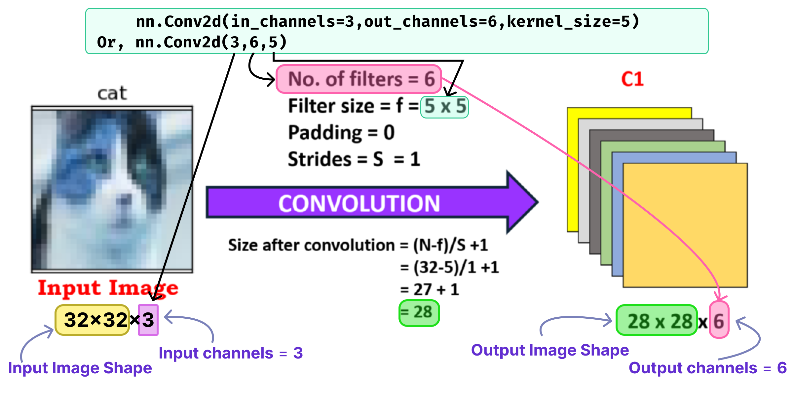
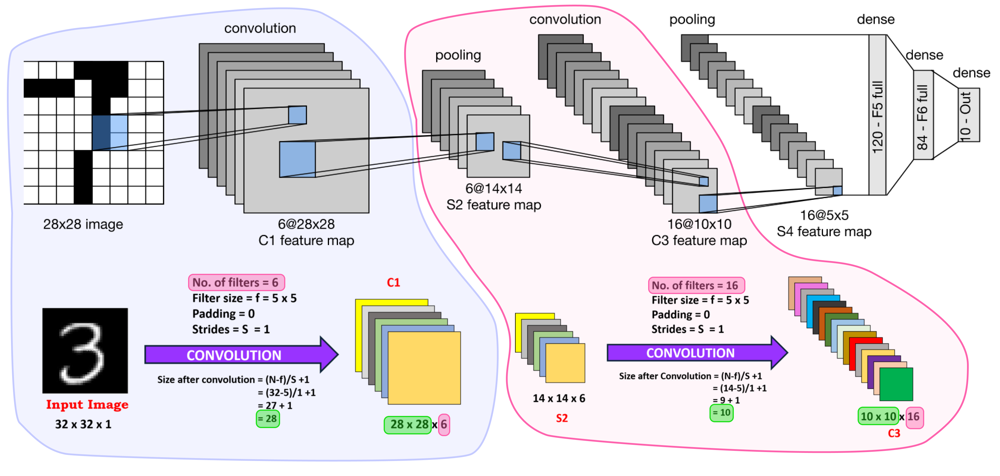

# CNN Basic with pytorch

- [CNN Basic with pytorch](#cnn-basic-with-pytorch)
  - [Load Dataset from `torchvision`](#load-dataset-from-torchvision)
  - [Single Convolution Layer](#single-convolution-layer)
  - [LeNet Architecture](#lenet-architecture)

```python
"""
cd .\03-cnn-basic\
jupyter nbconvert --to markdown cnn-basic.ipynb --output README.md
"""

import math
import numpy as np
import matplotlib.pyplot as plt
import matplotlib

import torch
import torch.nn.functional as Fn
import torch.nn as nn
```

## Load Dataset from `torchvision`

## Single Convolution Layer

<div align="center">

</div>


```python
class FirstCNN(nn.Module):
    def __init__(self) -> None:
        super().__init__()
        """
        in_channels: Number of channels in the input image
        out_channels: Number of channels produced by the convolution
        kernel_size: Size of the convolving kernel
        stride (int or tuple, optional): Stride of the convolution. Default: 1
        padding (int, tuple or str, optional): Padding added to all four sides of
            the input. Default: 0
        """
        self.conv1 = nn.Conv2d(in_channels=3,out_channels=6,kernel_size=5)

    def forward(self,X):
        X = self.conv1(X)
        return X
```

## LeNet Architecture

<div align="center">

</div>


```python

```


```python

```
