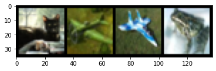
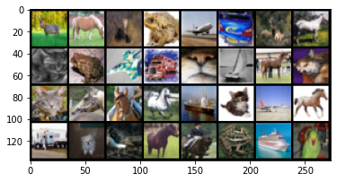
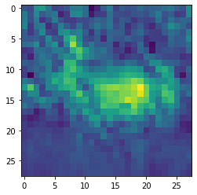
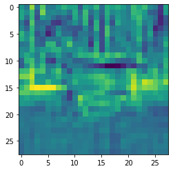
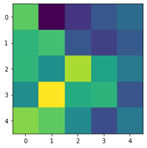
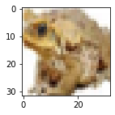
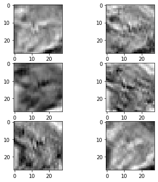
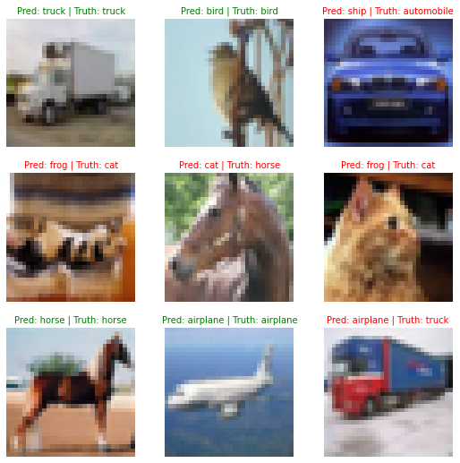
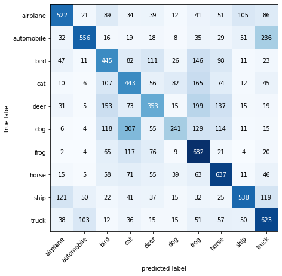

# CNN Basic with pytorch

- [CNN Basic with pytorch](#cnn-basic-with-pytorch)
  - [Load Dataset from `torchvision`](#load-dataset-from-torchvision)
  - [Visulize Data](#visulize-data)
  - [Single Convolution Layer](#single-convolution-layer)
  - [Deep Convolutional Network](#deep-convolutional-network)
  - [LeNet Architecture](#lenet-architecture)
    - [Get hold of individual layer:](#get-hold-of-individual-layer)
  - [Train LetNet](#train-letnet)
  - [Make and evaluate random predictions with best model](#make-and-evaluate-random-predictions-with-best-model)
    - [Visualize](#visualize)
  - [Making a confusion matrix for further prediction evaluation](#making-a-confusion-matrix-for-further-prediction-evaluation)


```python
"""
cd .\03-cnn-basic\
jupyter nbconvert --to markdown cnn-basic.ipynb --output README.md
"""

import math
import numpy as np
import matplotlib.pyplot as plt
import matplotlib

import torch
import torch.nn.functional as Fn
import torch.nn as nn
```

## Load Dataset from `torchvision`

- [Torchvision](https://pytorch.org/vision/stable/datasets.html)  provides many built-in datasets in the `torchvision.datasets` module, as well as utility classes for building your own datasets.


```python
import torchvision
from torchvision import datasets
from torchvision.transforms import ToTensor

# Setup training data
train_data = datasets.CIFAR10(
    root="data", # where to download data to?
    train=True, # get training data
    download=True, # download data if it doesn't exist on disk
    transform=ToTensor(), # images come as PIL format, we want to turn into Torch tensors
    target_transform=None # you can transform labels as well
)

# Setup testing data
test_data = datasets.CIFAR10(
    root="data",
    train=False, # get test data
    download=True,
    transform=ToTensor()
)

```

    Downloading https://www.cs.toronto.edu/~kriz/cifar-10-python.tar.gz to data/cifar-10-python.tar.gz


      0%|          | 0/170498071 [00:00<?, ?it/s]


    Extracting data/cifar-10-python.tar.gz to data
    Files already downloaded and verified


```python
# See classes
class_names = train_data.classes
class_names
```


    ['airplane',
     'automobile',
     'bird',
     'cat',
     'deer',
     'dog',
     'frog',
     'horse',
     'ship',
     'truck']


The next step is to prepare it with a `torch.utils.data.DataLoader` or `DataLoader` for short.

The DataLoader does what you think it might do. It helps load data into a model. For training and for inference. It turns a large Dataset into a Python iterable of smaller chunks. These smaller chunks are called `batches` or `mini-batches` and can be set by the `batch_size` parameter. Because it's more computationally efficient. `batch_size=32` is a good place to start for a fair amount of problems. But since this is a value you can set (a hyperparameter) you can try all different kinds of values, though generally powers of 2 are used most often (e.g. 32, 64, 128, 256, 512).


<div align="center">

</div>


```python
from torch.utils.data import DataLoader

# Setup the batch size hyperparameter
BATCH_SIZE = 32

# Turn datasets into iterables (batches)
train_dataloader = DataLoader(train_data, # dataset to turn into iterable
    batch_size=BATCH_SIZE, # how many samples per batch?
    shuffle=True # shuffle data every epoch?
)

test_dataloader = DataLoader(test_data,
    batch_size=BATCH_SIZE,
    shuffle=False # don't necessarily have to shuffle the testing data
)

# Let's check out what we've created
print(f"Length of train dataloader: {len(train_dataloader)} batches of {BATCH_SIZE}")
print(f"Length of test dataloader: {len(test_dataloader)} batches of {BATCH_SIZE}")
```

    Length of train dataloader: 1563 batches of 32
    Length of test dataloader: 313 batches of 32


```python
dataiter = iter(train_dataloader)
images,labels  = next(dataiter)
print(images.shape) # [32, 3, 32, 32] -> [batch_size,channels,image_size(x,y)]
```

    torch.Size([32, 3, 32, 32])


```python
print(len(images)) # 32 images per batch
print(images[0].shape) # [3 channels, 32x32]
print(labels[0].item())
```

    32
    torch.Size([3, 32, 32])
    0


## Visulize Data


```python
img = images[0]
print(type(img))
```

    <class 'torch.Tensor'>


```python
npimg = img.numpy()
print(npimg.shape)
```

    (3, 32, 32)


```python
npimg = np.transpose(npimg,(1,2,0))
print(npimg.shape) # [32x32,3 channels]

```

    (32, 32, 3)


```python
plt.figure(figsize=(2,2))
plt.imshow(npimg)
plt.show()
```





```python
def imshow(img):
    npimg = img.numpy()
    npimg = np.transpose(npimg,(1,2,0))
    plt.imshow(npimg)
    plt.show()
```


```python
imshow(torchvision.utils.make_grid(images))
```





## Single Convolution Layer

<div align="center">

</div>


```python
class FirstCNN(nn.Module):
    def __init__(self) -> None:
        super().__init__()
        """
        in_channels: Number of channels in the input image
        out_channels: Number of channels produced by the convolution
        kernel_size: Size of the convolving kernel
        stride (int or tuple, optional): Stride of the convolution. Default: 1
        padding (int, tuple or str, optional): Padding added to all four sides of
            the input. Default: 0
        """
        self.conv1 = nn.Conv2d(in_channels=3,out_channels=6,kernel_size=5)
        #IN: (B,InC:3,32x32) -> OUT: (B,OutC:6,[32-(5-S1)x32-(5-1)]) -> OUT: (B,6C,28x28)

    def forward(self,X):
        X = self.conv1(X)
        return X
```


```python
net = FirstCNN()
out  = net(images)
out.shape
```


    torch.Size([32, 6, 28, 28])


```python
for param in net.parameters():
    print(param.shape) #total number of parameters of (f*f*InC+1)*OutC.

```

    torch.Size([6, 3, 5, 5])
    torch.Size([6])


```python
out1 = out[0,0,:,:].detach().numpy() #0th image of the batch,0th chanel, all x, all y
print(out1.shape)
```

    (28, 28)


```python
# ploting
plt.imshow(out[0,0,:,:].detach().numpy())
plt.show()
```





## Deep Convolutional Network


```python
class FirstCNN_v2(nn.Module):
    def __init__(self) -> None:
        super().__init__()
        self.model = nn.Sequential(
            nn.Conv2d(3,8,3), # (B,InC:3,32x32) -> (B,OutC:8,30X30)
            nn.Conv2d(8,16,3) # (B,InC:8,30X30) -> (B,OutC:16,28x28)
        )

    def forward(self,X):
        X = self.model(X)
        return X
```


```python
net = FirstCNN_v2()
out = net(images)
out.shape
```


    torch.Size([32, 16, 28, 28])


```python
plt.imshow(out[0,0,:,:].detach().numpy())
plt.show()
```





```python
class FirstCNN_v3(nn.Module):
    def __init__(self) -> None:
        super().__init__()
        self.model = nn.Sequential(
            nn.Conv2d(3,6,5), # (B,InC:3,32x32) -> (B,OutC:6,28x28)
            nn.AvgPool2d(2,stride=2), # (B,6,28x28) ->(B,6,[28/sx28/s]) -> (B,6,14x14)
            nn.Conv2d(6,16,5), # (B,6,14x14) -> (B,16,10x10)
            nn.AvgPool2d(2,stride=2) # (B,16,10x10) ->(B,16,5x5)

        )

    def forward(self,X):
        X = self.model(X)
        return X
```


```python
net = FirstCNN_v3()
out = net(images)
out.shape
```


    torch.Size([32, 16, 5, 5])


```python
plt.imshow(out[0,0,:,:].detach().numpy())
plt.show()
```





## LeNet Architecture

<div align="center">

</div>


```python
class LeNet(nn.Module):
    def __init__(self) -> None:
        super().__init__()
        self.cnn_layer = nn.Sequential(
            nn.Conv2d(3,6,5),               # (B,3,32X32)   ->    (B,6,28X28)
            nn.Tanh(),
            nn.AvgPool2d(2,stride=2),       # (B,6,28X28)   ->    (B,6,14X14)
            nn.Conv2d(6,16,5),              # (B,6,14X14)   ->    (B,16,10X10)
            nn.Tanh(),
            nn.AvgPool2d(2,stride=2),       # (B,16,10X10)  ->    (B,16,5X5)
        )
        self.fc_layer = nn.Sequential(
            nn.Linear(400,120),             # (16X5X5) ~ (B,400) ->(B,120)
            nn.Tanh(),
            nn.Linear(120,84),              #            (B,120) ->(B,84)
            nn.Tanh(),
            nn.Linear(84,10)                #            (B,84) ->(B,10)
        )

    def forward(self,x):
        print(f"Input Shape:\n {x.shape}")
        x = self.cnn_layer(x)
        print(f"Conv Output Shape:\n {x.shape}")
        x = x.view(x.shape[0],-1)
        print(f"Flatten 16X5X5:\n {x.shape}")
        x = self.fc_layer(x)
        print(f"Finnal Output:\n {x.shape}")
        return x
```


```python
net = LeNet()
out = net(images)
out.shape
```

    Input Shape:
     torch.Size([32, 3, 32, 32])
    Conv Output Shape:
     torch.Size([32, 16, 5, 5])
    Flatten 16X5X5:
     torch.Size([32, 400])
    Finnal Output:
     torch.Size([32, 10])


    torch.Size([32, 10])


```python
out.data[:5]
```


    tensor([[ 0.0856,  0.0488,  0.0055, -0.0714,  0.0173,  0.0363, -0.0244,  0.0228,
              0.0612, -0.0432],
            [ 0.0991,  0.0505,  0.0132, -0.0533,  0.0206,  0.0412, -0.0313,  0.0236,
              0.0794, -0.0351],
            [ 0.0884,  0.0510,  0.0114, -0.0692,  0.0147,  0.0407, -0.0335,  0.0203,
              0.0694, -0.0393],
            [ 0.0985,  0.0478,  0.0211, -0.0551,  0.0162,  0.0437, -0.0223,  0.0190,
              0.0757, -0.0330],
            [ 0.1024,  0.0482,  0.0212, -0.0611,  0.0173,  0.0460, -0.0314,  0.0213,
              0.0880, -0.0226]])


```python
max_vals,pred_class = torch.max(out.data,dim=1)
pred_class
```


    tensor([0, 0, 0, 0, 0, 0, 0, 8, 0, 0, 0, 0, 0, 0, 0, 0, 0, 0, 0, 0, 0, 0, 0, 0,
            0, 0, 0, 0, 0, 0, 0, 0])


### Get hold of individual layer:


```python
out = net.cnn_layer[0](images) # Result of first convolution
out.shape
```


    torch.Size([32, 6, 28, 28])


```python
image_id =3
plt.figure(figsize=(2,2))
imshow(images[image_id])
```





```python
# ploting each channel of a resultant image after conv1
plt.figure(figsize=(6,6))
plt.subplot(321)
for i in range(6):
    ax = plt.subplot(3,2,i+1)
    ax.imshow(out[image_id,i,:,:].detach().numpy(),cmap="binary")
plt.show()
```





## Train LetNet


```python
class LeNet(nn.Module):
    def __init__(self) -> None:
        super().__init__()
        self.cnn_layer = nn.Sequential(
            nn.Conv2d(3,6,5),               # (B,3,32X32)   ->    (B,6,28X28)
            nn.Tanh(),
            nn.AvgPool2d(2,stride=2),       # (B,6,28X28)   ->    (B,6,14X14)
            nn.Conv2d(6,16,5),              # (B,6,14X14)   ->    (B,16,10X10)
            nn.Tanh(),
            nn.AvgPool2d(2,stride=2),       # (B,16,10X10)  ->    (B,16,5X5)
        )
        self.fc_layer = nn.Sequential(
            nn.Linear(400,120),             # (16X5X5) ~ (B,400) ->(B,120)
            nn.Tanh(),
            nn.Linear(120,84),              #            (B,120) ->(B,84)
            nn.Tanh(),
            nn.Linear(84,10)                #            (B,84) ->(B,10)
        )

    def forward(self,x):
        x = self.cnn_layer(x)
        x = x.view(x.shape[0],-1)
        x = self.fc_layer(x)
        return x
```


```python
# Setup device agnostic code
import torch
device = "cuda" if torch.cuda.is_available() else "cpu"
device
```


    'cuda'


```python
from tqdm.notebook import tqdm
import torch.optim as optim
net = LeNet().to(device)
# Setup loss and optimizer
loss_fn = nn.CrossEntropyLoss()
optimizer = torch.optim.SGD(params=net.parameters(),
                             lr=0.1)
```


```python
def accuracy_fn(y_true, y_pred):
    """Calculates accuracy between truth labels and predictions.
    Args:
        y_true (torch.Tensor): Truth labels for predictions.
        y_pred (torch.Tensor): Predictions to be compared to predictions.
    Returns:
        [torch.float]: Accuracy value between y_true and y_pred, e.g. 78.45
    """
    correct = torch.eq(y_true, y_pred).sum().item()
    acc = (correct / len(y_pred)) * 100
    return acc
```


```python
def train_step(model: torch.nn.Module,
               data_loader: torch.utils.data.DataLoader,
               loss_fn: torch.nn.Module,
               optimizer: torch.optim.Optimizer,
               accuracy_fn,
               device: torch.device = device):
    train_loss, train_acc = 0, 0
    model.train()
    for batch, (X, y) in enumerate(data_loader):
        # Send data to GPU
        X, y = X.to(device), y.to(device)

        # 1. Forward pass
        y_pred = model(X)

        # 2. Calculate loss
        loss = loss_fn(y_pred, y)
        train_loss += loss
        train_acc += accuracy_fn(y_true=y,
                                 y_pred=y_pred.argmax(dim=1)) # Go from logits -> pred labels

        # 3. Optimizer zero grad
        optimizer.zero_grad()

        # 4. Loss backward
        loss.backward()

        # 5. Optimizer step
        optimizer.step()

    # Calculate loss and accuracy per epoch and print out what's happening
    train_loss /= len(data_loader)
    train_acc /= len(data_loader)
    print(f"Train loss: {train_loss:.5f} | Train accuracy: {train_acc:.2f}%")

def test_step(data_loader: torch.utils.data.DataLoader,
              model: torch.nn.Module,
              loss_fn: torch.nn.Module,
              accuracy_fn,
              device: torch.device = device):
    test_loss, test_acc = 0, 0
    model.eval() # put model in eval mode
    # Turn on inference context manager
    with torch.inference_mode():
        for X, y in data_loader:
            # Send data to GPU
            X, y = X.to(device), y.to(device)

            # 1. Forward pass
            test_pred = model(X)

            # 2. Calculate loss and accuracy
            test_loss += loss_fn(test_pred, y)
            test_acc += accuracy_fn(y_true=y,
                y_pred=test_pred.argmax(dim=1) # Go from logits -> pred labels
            )

        # Adjust metrics and print out
        test_loss /= len(data_loader)
        test_acc /= len(data_loader)
        print(f"Test loss: {test_loss:.5f} | Test accuracy: {test_acc:.2f}%\n")
```


```python
%%time
torch.manual_seed(42)
epochs = 3
for epoch in tqdm(range(epochs)):
    print(f"Epoch: {epoch}")
    train_step(data_loader=train_dataloader,
        model=net,
        loss_fn=loss_fn,
        optimizer=optimizer,
        accuracy_fn=accuracy_fn
    )
    test_step(data_loader=test_dataloader,
        model=net,
        loss_fn=loss_fn,
        accuracy_fn=accuracy_fn
    )


```


      0%|          | 0/3 [00:00<?, ?it/s]


    Epoch: 0
    Train loss: 1.86195 | Train accuracy: 32.68%
    Test loss: 1.61555 | Test accuracy: 41.05%

    Epoch: 1
    Train loss: 1.54129 | Train accuracy: 44.33%
    Test loss: 1.57507 | Test accuracy: 44.98%

    Epoch: 2
    Train loss: 1.41848 | Train accuracy: 49.18%
    Test loss: 1.39009 | Test accuracy: 50.39%

    CPU times: user 37.6 s, sys: 830 ms, total: 38.5 s
    Wall time: 38.5 s


```python
# Move values to device
torch.manual_seed(42)
def eval_model(model: torch.nn.Module,
               data_loader: torch.utils.data.DataLoader,
               loss_fn: torch.nn.Module,
               accuracy_fn,
               device: torch.device = device):
    """Evaluates a given model on a given dataset.

    Args:
        model (torch.nn.Module): A PyTorch model capable of making predictions on data_loader.
        data_loader (torch.utils.data.DataLoader): The target dataset to predict on.
        loss_fn (torch.nn.Module): The loss function of model.
        accuracy_fn: An accuracy function to compare the models predictions to the truth labels.
        device (str, optional): Target device to compute on. Defaults to device.

    Returns:
        (dict): Results of model making predictions on data_loader.
    """
    loss, acc = 0, 0
    model.eval()
    with torch.inference_mode():
        for X, y in data_loader:
            # Send data to the target device
            X, y = X.to(device), y.to(device)
            y_pred = model(X)
            loss += loss_fn(y_pred, y)
            acc += accuracy_fn(y_true=y, y_pred=y_pred.argmax(dim=1))

        # Scale loss and acc
        loss /= len(data_loader)
        acc /= len(data_loader)
    return {"model_name": model.__class__.__name__, # only works when model was created with a class
            "model_loss": loss.item(),
            "model_acc": acc}

# Calculate model 1 results with device-agnostic code
model_1_results = eval_model(model=net, data_loader=test_dataloader,
    loss_fn=loss_fn, accuracy_fn=accuracy_fn,
    device=device
)
model_1_results
```


    {'model_name': 'LeNet',
     'model_loss': 1.3900883197784424,
     'model_acc': 50.38937699680511}


Compare model results and training time


```python
import pandas as pd
compare_results = pd.DataFrame([model_1_results,model_1_results])
compare_results
```


  <div id="df-ea3aa87d-cdb3-42b3-b1d5-ef3d4b53d17a">
    <div class="colab-df-container">
      <div>
<style scoped>
    .dataframe tbody tr th:only-of-type {
        vertical-align: middle;
    }

    .dataframe tbody tr th {
        vertical-align: top;
    }

    .dataframe thead th {
        text-align: right;
    }
</style>
<table border="1" class="dataframe">
  <thead>
    <tr style="text-align: right;">
      <th></th>
      <th>model_name</th>
      <th>model_loss</th>
      <th>model_acc</th>
    </tr>
  </thead>
  <tbody>
    <tr>
      <th>0</th>
      <td>LeNet</td>
      <td>1.390088</td>
      <td>50.389377</td>
    </tr>
    <tr>
      <th>1</th>
      <td>LeNet</td>
      <td>1.390088</td>
      <td>50.389377</td>
    </tr>
  </tbody>
</table>
</div>
      <button class="colab-df-convert" onclick="convertToInteractive('df-ea3aa87d-cdb3-42b3-b1d5-ef3d4b53d17a')"
              title="Convert this dataframe to an interactive table."
              style="display:none;">

  <svg xmlns="http://www.w3.org/2000/svg" height="24px"viewBox="0 0 24 24"
       width="24px">
    <path d="M0 0h24v24H0V0z" fill="none"/>
    <path d="M18.56 5.44l.94 2.06.94-2.06 2.06-.94-2.06-.94-.94-2.06-.94 2.06-2.06.94zm-11 1L8.5 8.5l.94-2.06 2.06-.94-2.06-.94L8.5 2.5l-.94 2.06-2.06.94zm10 10l.94 2.06.94-2.06 2.06-.94-2.06-.94-.94-2.06-.94 2.06-2.06.94z"/><path d="M17.41 7.96l-1.37-1.37c-.4-.4-.92-.59-1.43-.59-.52 0-1.04.2-1.43.59L10.3 9.45l-7.72 7.72c-.78.78-.78 2.05 0 2.83L4 21.41c.39.39.9.59 1.41.59.51 0 1.02-.2 1.41-.59l7.78-7.78 2.81-2.81c.8-.78.8-2.07 0-2.86zM5.41 20L4 18.59l7.72-7.72 1.47 1.35L5.41 20z"/>
  </svg>
      </button>

  <style>
    .colab-df-container {
      display:flex;
      flex-wrap:wrap;
      gap: 12px;
    }

    .colab-df-convert {
      background-color: #E8F0FE;
      border: none;
      border-radius: 50%;
      cursor: pointer;
      display: none;
      fill: #1967D2;
      height: 32px;
      padding: 0 0 0 0;
      width: 32px;
    }

    .colab-df-convert:hover {
      background-color: #E2EBFA;
      box-shadow: 0px 1px 2px rgba(60, 64, 67, 0.3), 0px 1px 3px 1px rgba(60, 64, 67, 0.15);
      fill: #174EA6;
    }

    [theme=dark] .colab-df-convert {
      background-color: #3B4455;
      fill: #D2E3FC;
    }

    [theme=dark] .colab-df-convert:hover {
      background-color: #434B5C;
      box-shadow: 0px 1px 3px 1px rgba(0, 0, 0, 0.15);
      filter: drop-shadow(0px 1px 2px rgba(0, 0, 0, 0.3));
      fill: #FFFFFF;
    }
  </style>

      <script>
        const buttonEl =
          document.querySelector('#df-ea3aa87d-cdb3-42b3-b1d5-ef3d4b53d17a button.colab-df-convert');
        buttonEl.style.display =
          google.colab.kernel.accessAllowed ? 'block' : 'none';

        async function convertToInteractive(key) {
          const element = document.querySelector('#df-ea3aa87d-cdb3-42b3-b1d5-ef3d4b53d17a');
          const dataTable =
            await google.colab.kernel.invokeFunction('convertToInteractive',
                                                     [key], {});
          if (!dataTable) return;

          const docLinkHtml = 'Like what you see? Visit the ' +
            '<a target="_blank" href=https://colab.research.google.com/notebooks/data_table.ipynb>data table notebook</a>'
            + ' to learn more about interactive tables.';
          element.innerHTML = '';
          dataTable['output_type'] = 'display_data';
          await google.colab.output.renderOutput(dataTable, element);
          const docLink = document.createElement('div');
          docLink.innerHTML = docLinkHtml;
          element.appendChild(docLink);
        }
      </script>
    </div>
  </div>


## Make and evaluate random predictions with best model


```python
def make_predictions(model: torch.nn.Module, data: list, device: torch.device = device):
    pred_probs = []
    model.eval()
    with torch.inference_mode():
        for sample in data:
            # Prepare sample
            sample = torch.unsqueeze(sample, dim=0).to(device) # Add an extra dimension and send sample to device

            # Forward pass (model outputs raw logit)
            pred_logit = model(sample)

            # Get prediction probability (logit -> prediction probability)
            pred_prob = torch.softmax(pred_logit.squeeze(), dim=0)

            # Get pred_prob off GPU for further calculations
            pred_probs.append(pred_prob.cpu())

    # Stack the pred_probs to turn list into a tensor
    return torch.stack(pred_probs)
```


```python
import random
random.seed(42)
test_samples = []
test_labels = []
for sample, label in random.sample(list(test_data), k=9):
    test_samples.append(sample)
    test_labels.append(label)

# View the first test sample shape and label
print(f"Test sample image shape: {test_samples[0].shape}\nTest sample label: {test_labels[0]} ({class_names[test_labels[0]]})")
```

    Test sample image shape: torch.Size([3, 32, 32])
    Test sample label: 9 (truck)


```python
# Make predictions on test samples with model 2
pred_probs= make_predictions(model=net,
                             data=test_samples)

# View first two prediction probabilities list
pred_probs[:2]
```


    tensor([[1.4824e-02, 1.5669e-02, 6.0795e-03, 1.3026e-02, 1.7584e-02, 4.4088e-03,
             3.8525e-03, 4.5362e-02, 1.7623e-02, 8.6157e-01],
            [6.1030e-03, 1.3060e-04, 7.8985e-01, 9.4827e-02, 2.3942e-02, 4.2816e-02,
             1.3580e-02, 2.2112e-02, 7.3267e-04, 5.9027e-03]])


```python
# Turn the prediction probabilities into prediction labels by taking the argmax()
pred_classes = pred_probs.argmax(dim=1)
pred_classes
```


    tensor([9, 2, 8, 6, 3, 6, 7, 0, 0])


```python
# Are our predictions in the same form as our test labels?
test_labels, pred_classes
```


    ([9, 2, 1, 3, 7, 3, 7, 0, 9], tensor([9, 2, 8, 6, 3, 6, 7, 0, 0]))


### Visualize


```python
# Plot predictions
plt.figure(figsize=(9, 9))
nrows = 3
ncols = 3
for i, sample in enumerate(test_samples):
  # Create a subplot
  plt.subplot(nrows, ncols, i+1)
  npimg = sample.numpy()
  npimg = np.transpose(npimg,(1,2,0))
  # Plot the target image
  plt.imshow(npimg, cmap="gray")

  # Find the prediction label (in text form, e.g. "Sandal")
  pred_label = class_names[pred_classes[i]]

  # Get the truth label (in text form, e.g. "T-shirt")
  truth_label = class_names[test_labels[i]]

  # Create the title text of the plot
  title_text = f"Pred: {pred_label} | Truth: {truth_label}"

  # Check for equality and change title colour accordingly
  if pred_label == truth_label:
      plt.title(title_text, fontsize=10, c="g") # green text if correct
  else:
      plt.title(title_text, fontsize=10, c="r") # red text if wrong
  plt.axis(False);
```





## Making a confusion matrix for further prediction evaluation


```python
# Import tqdm for progress bar
from tqdm.auto import tqdm

# 1. Make predictions with trained model
y_preds = []
net.eval()
with torch.inference_mode():
  for X, y in tqdm(test_dataloader, desc="Making predictions"):
    # Send data and targets to target device
    X, y = X.to(device), y.to(device)
    # Do the forward pass
    y_logit = net(X)
    # Turn predictions from logits -> prediction probabilities -> predictions labels
    y_pred = torch.softmax(y_logit, dim=1).argmax(dim=1)
    # Put predictions on CPU for evaluation
    y_preds.append(y_pred.cpu())
# Concatenate list of predictions into a tensor
y_pred_tensor = torch.cat(y_preds)
```


    Making predictions:   0%|          | 0/313 [00:00<?, ?it/s]


1. Make a confusion matrix using `torchmetrics.ConfusionMatrix.`
2. Plot the confusion matrix using `seaborn`, `mlxtend.plotting.plot_confusion_matrix().` or `plotly`


```python
!pip install mlxtend -U > /dev/null
!pip install torchmetrics > /dev/null
```


```python
from torchmetrics import ConfusionMatrix
from mlxtend.plotting import plot_confusion_matrix

# 2. Setup confusion matrix instance and compare predictions to targets
confmat = ConfusionMatrix(num_classes=len(class_names), task='multiclass')
confmat_tensor = confmat(preds=y_pred_tensor,
                         target=torch.tensor(test_data.targets))

# 3. Plot the confusion matrix
fig, ax = plot_confusion_matrix(
    conf_mat=confmat_tensor.numpy(), # matplotlib likes working with NumPy
    class_names=class_names, # turn the row and column labels into class names
    figsize=(10, 7)
);
```





```python
len(class_names)
```


    10


```python
import plotly.express as px

fig = px.imshow(confmat_tensor,text_auto=True,x=class_names,y=class_names)
fig.show()
```


<html>
<head><meta charset="utf-8" /></head>
<body>
    <div>            <script src="https://cdnjs.cloudflare.com/ajax/libs/mathjax/2.7.5/MathJax.js?config=TeX-AMS-MML_SVG"></script><script type="text/javascript">if (window.MathJax) {MathJax.Hub.Config({SVG: {font: "STIX-Web"}});}</script>                <script type="text/javascript">window.PlotlyConfig = {MathJaxConfig: 'local'};</script>
        <script src="https://cdn.plot.ly/plotly-2.8.3.min.js"></script>                <div id="a2db18e2-3e25-46f6-9000-2b09f6249f74" class="plotly-graph-div" style="height:525px; width:100%;"></div>            <script type="text/javascript">                                    window.PLOTLYENV=window.PLOTLYENV || {};                                    if (document.getElementById("a2db18e2-3e25-46f6-9000-2b09f6249f74")) {                    Plotly.newPlot(                        "a2db18e2-3e25-46f6-9000-2b09f6249f74",                        [{"coloraxis":"coloraxis","name":"0","texttemplate":"%{z}","x":["airplane","automobile","bird","cat","deer","dog","frog","horse","ship","truck"],"y":["airplane","automobile","bird","cat","deer","dog","frog","horse","ship","truck"],"z":[[522,21,89,34,39,12,41,51,105,86],[32,556,16,19,18,8,35,29,51,236],[47,11,445,82,111,26,146,98,11,23],[10,6,107,443,56,82,165,74,12,45],[31,5,153,73,353,15,199,137,15,19],[6,4,118,307,55,241,129,114,11,15],[2,4,65,117,76,9,682,21,4,20],[15,5,58,71,55,39,63,637,11,46],[121,50,22,41,37,15,32,25,538,119],[38,103,12,36,15,15,51,57,50,623]],"type":"heatmap","xaxis":"x","yaxis":"y","hovertemplate":"x: %{x}<br>y: %{y}<br>color: %{z}<extra></extra>"}],                        {"template":{"data":{"bar":[{"error_x":{"color":"#2a3f5f"},"error_y":{"color":"#2a3f5f"},"marker":{"line":{"color":"#E5ECF6","width":0.5},"pattern":{"fillmode":"overlay","size":10,"solidity":0.2}},"type":"bar"}],"barpolar":[{"marker":{"line":{"color":"#E5ECF6","width":0.5},"pattern":{"fillmode":"overlay","size":10,"solidity":0.2}},"type":"barpolar"}],"carpet":[{"aaxis":{"endlinecolor":"#2a3f5f","gridcolor":"white","linecolor":"white","minorgridcolor":"white","startlinecolor":"#2a3f5f"},"baxis":{"endlinecolor":"#2a3f5f","gridcolor":"white","linecolor":"white","minorgridcolor":"white","startlinecolor":"#2a3f5f"},"type":"carpet"}],"choropleth":[{"colorbar":{"outlinewidth":0,"ticks":""},"type":"choropleth"}],"contour":[{"colorbar":{"outlinewidth":0,"ticks":""},"colorscale":[[0.0,"#0d0887"],[0.1111111111111111,"#46039f"],[0.2222222222222222,"#7201a8"],[0.3333333333333333,"#9c179e"],[0.4444444444444444,"#bd3786"],[0.5555555555555556,"#d8576b"],[0.6666666666666666,"#ed7953"],[0.7777777777777778,"#fb9f3a"],[0.8888888888888888,"#fdca26"],[1.0,"#f0f921"]],"type":"contour"}],"contourcarpet":[{"colorbar":{"outlinewidth":0,"ticks":""},"type":"contourcarpet"}],"heatmap":[{"colorbar":{"outlinewidth":0,"ticks":""},"colorscale":[[0.0,"#0d0887"],[0.1111111111111111,"#46039f"],[0.2222222222222222,"#7201a8"],[0.3333333333333333,"#9c179e"],[0.4444444444444444,"#bd3786"],[0.5555555555555556,"#d8576b"],[0.6666666666666666,"#ed7953"],[0.7777777777777778,"#fb9f3a"],[0.8888888888888888,"#fdca26"],[1.0,"#f0f921"]],"type":"heatmap"}],"heatmapgl":[{"colorbar":{"outlinewidth":0,"ticks":""},"colorscale":[[0.0,"#0d0887"],[0.1111111111111111,"#46039f"],[0.2222222222222222,"#7201a8"],[0.3333333333333333,"#9c179e"],[0.4444444444444444,"#bd3786"],[0.5555555555555556,"#d8576b"],[0.6666666666666666,"#ed7953"],[0.7777777777777778,"#fb9f3a"],[0.8888888888888888,"#fdca26"],[1.0,"#f0f921"]],"type":"heatmapgl"}],"histogram":[{"marker":{"pattern":{"fillmode":"overlay","size":10,"solidity":0.2}},"type":"histogram"}],"histogram2d":[{"colorbar":{"outlinewidth":0,"ticks":""},"colorscale":[[0.0,"#0d0887"],[0.1111111111111111,"#46039f"],[0.2222222222222222,"#7201a8"],[0.3333333333333333,"#9c179e"],[0.4444444444444444,"#bd3786"],[0.5555555555555556,"#d8576b"],[0.6666666666666666,"#ed7953"],[0.7777777777777778,"#fb9f3a"],[0.8888888888888888,"#fdca26"],[1.0,"#f0f921"]],"type":"histogram2d"}],"histogram2dcontour":[{"colorbar":{"outlinewidth":0,"ticks":""},"colorscale":[[0.0,"#0d0887"],[0.1111111111111111,"#46039f"],[0.2222222222222222,"#7201a8"],[0.3333333333333333,"#9c179e"],[0.4444444444444444,"#bd3786"],[0.5555555555555556,"#d8576b"],[0.6666666666666666,"#ed7953"],[0.7777777777777778,"#fb9f3a"],[0.8888888888888888,"#fdca26"],[1.0,"#f0f921"]],"type":"histogram2dcontour"}],"mesh3d":[{"colorbar":{"outlinewidth":0,"ticks":""},"type":"mesh3d"}],"parcoords":[{"line":{"colorbar":{"outlinewidth":0,"ticks":""}},"type":"parcoords"}],"pie":[{"automargin":true,"type":"pie"}],"scatter":[{"marker":{"colorbar":{"outlinewidth":0,"ticks":""}},"type":"scatter"}],"scatter3d":[{"line":{"colorbar":{"outlinewidth":0,"ticks":""}},"marker":{"colorbar":{"outlinewidth":0,"ticks":""}},"type":"scatter3d"}],"scattercarpet":[{"marker":{"colorbar":{"outlinewidth":0,"ticks":""}},"type":"scattercarpet"}],"scattergeo":[{"marker":{"colorbar":{"outlinewidth":0,"ticks":""}},"type":"scattergeo"}],"scattergl":[{"marker":{"colorbar":{"outlinewidth":0,"ticks":""}},"type":"scattergl"}],"scattermapbox":[{"marker":{"colorbar":{"outlinewidth":0,"ticks":""}},"type":"scattermapbox"}],"scatterpolar":[{"marker":{"colorbar":{"outlinewidth":0,"ticks":""}},"type":"scatterpolar"}],"scatterpolargl":[{"marker":{"colorbar":{"outlinewidth":0,"ticks":""}},"type":"scatterpolargl"}],"scatterternary":[{"marker":{"colorbar":{"outlinewidth":0,"ticks":""}},"type":"scatterternary"}],"surface":[{"colorbar":{"outlinewidth":0,"ticks":""},"colorscale":[[0.0,"#0d0887"],[0.1111111111111111,"#46039f"],[0.2222222222222222,"#7201a8"],[0.3333333333333333,"#9c179e"],[0.4444444444444444,"#bd3786"],[0.5555555555555556,"#d8576b"],[0.6666666666666666,"#ed7953"],[0.7777777777777778,"#fb9f3a"],[0.8888888888888888,"#fdca26"],[1.0,"#f0f921"]],"type":"surface"}],"table":[{"cells":{"fill":{"color":"#EBF0F8"},"line":{"color":"white"}},"header":{"fill":{"color":"#C8D4E3"},"line":{"color":"white"}},"type":"table"}]},"layout":{"annotationdefaults":{"arrowcolor":"#2a3f5f","arrowhead":0,"arrowwidth":1},"autotypenumbers":"strict","coloraxis":{"colorbar":{"outlinewidth":0,"ticks":""}},"colorscale":{"diverging":[[0,"#8e0152"],[0.1,"#c51b7d"],[0.2,"#de77ae"],[0.3,"#f1b6da"],[0.4,"#fde0ef"],[0.5,"#f7f7f7"],[0.6,"#e6f5d0"],[0.7,"#b8e186"],[0.8,"#7fbc41"],[0.9,"#4d9221"],[1,"#276419"]],"sequential":[[0.0,"#0d0887"],[0.1111111111111111,"#46039f"],[0.2222222222222222,"#7201a8"],[0.3333333333333333,"#9c179e"],[0.4444444444444444,"#bd3786"],[0.5555555555555556,"#d8576b"],[0.6666666666666666,"#ed7953"],[0.7777777777777778,"#fb9f3a"],[0.8888888888888888,"#fdca26"],[1.0,"#f0f921"]],"sequentialminus":[[0.0,"#0d0887"],[0.1111111111111111,"#46039f"],[0.2222222222222222,"#7201a8"],[0.3333333333333333,"#9c179e"],[0.4444444444444444,"#bd3786"],[0.5555555555555556,"#d8576b"],[0.6666666666666666,"#ed7953"],[0.7777777777777778,"#fb9f3a"],[0.8888888888888888,"#fdca26"],[1.0,"#f0f921"]]},"colorway":["#636efa","#EF553B","#00cc96","#ab63fa","#FFA15A","#19d3f3","#FF6692","#B6E880","#FF97FF","#FECB52"],"font":{"color":"#2a3f5f"},"geo":{"bgcolor":"white","lakecolor":"white","landcolor":"#E5ECF6","showlakes":true,"showland":true,"subunitcolor":"white"},"hoverlabel":{"align":"left"},"hovermode":"closest","mapbox":{"style":"light"},"paper_bgcolor":"white","plot_bgcolor":"#E5ECF6","polar":{"angularaxis":{"gridcolor":"white","linecolor":"white","ticks":""},"bgcolor":"#E5ECF6","radialaxis":{"gridcolor":"white","linecolor":"white","ticks":""}},"scene":{"xaxis":{"backgroundcolor":"#E5ECF6","gridcolor":"white","gridwidth":2,"linecolor":"white","showbackground":true,"ticks":"","zerolinecolor":"white"},"yaxis":{"backgroundcolor":"#E5ECF6","gridcolor":"white","gridwidth":2,"linecolor":"white","showbackground":true,"ticks":"","zerolinecolor":"white"},"zaxis":{"backgroundcolor":"#E5ECF6","gridcolor":"white","gridwidth":2,"linecolor":"white","showbackground":true,"ticks":"","zerolinecolor":"white"}},"shapedefaults":{"line":{"color":"#2a3f5f"}},"ternary":{"aaxis":{"gridcolor":"white","linecolor":"white","ticks":""},"baxis":{"gridcolor":"white","linecolor":"white","ticks":""},"bgcolor":"#E5ECF6","caxis":{"gridcolor":"white","linecolor":"white","ticks":""}},"title":{"x":0.05},"xaxis":{"automargin":true,"gridcolor":"white","linecolor":"white","ticks":"","title":{"standoff":15},"zerolinecolor":"white","zerolinewidth":2},"yaxis":{"automargin":true,"gridcolor":"white","linecolor":"white","ticks":"","title":{"standoff":15},"zerolinecolor":"white","zerolinewidth":2}}},"xaxis":{"anchor":"y","domain":[0.0,1.0],"scaleanchor":"y","constrain":"domain"},"yaxis":{"anchor":"x","domain":[0.0,1.0],"autorange":"reversed","constrain":"domain"},"coloraxis":{"colorscale":[[0.0,"#0d0887"],[0.1111111111111111,"#46039f"],[0.2222222222222222,"#7201a8"],[0.3333333333333333,"#9c179e"],[0.4444444444444444,"#bd3786"],[0.5555555555555556,"#d8576b"],[0.6666666666666666,"#ed7953"],[0.7777777777777778,"#fb9f3a"],[0.8888888888888888,"#fdca26"],[1.0,"#f0f921"]]},"margin":{"t":60}},                        {"responsive": true}                    ).then(function(){

var gd = document.getElementById('a2db18e2-3e25-46f6-9000-2b09f6249f74');
var x = new MutationObserver(function (mutations, observer) {{
        var display = window.getComputedStyle(gd).display;
        if (!display || display === 'none') {{
            console.log([gd, 'removed!']);
            Plotly.purge(gd);
            observer.disconnect();
        }}
}});

// Listen for the removal of the full notebook cells
var notebookContainer = gd.closest('#notebook-container');
if (notebookContainer) {{
    x.observe(notebookContainer, {childList: true});
}}

// Listen for the clearing of the current output cell
var outputEl = gd.closest('.output');
if (outputEl) {{
    x.observe(outputEl, {childList: true});
}}

                        })                };                            </script>        </div>
</body>
</html>

