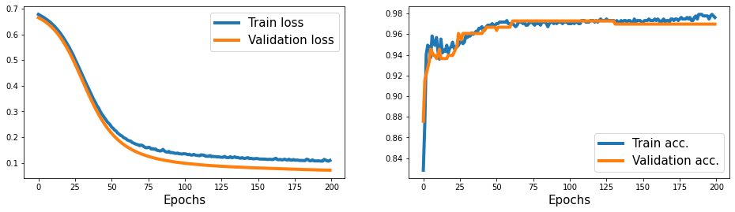
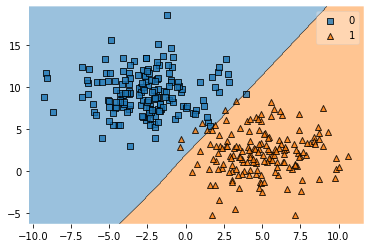
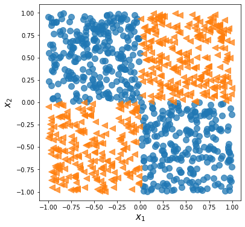
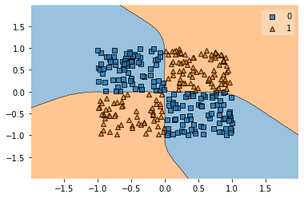
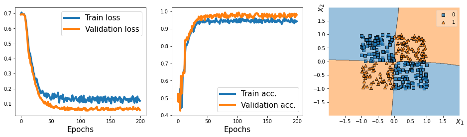
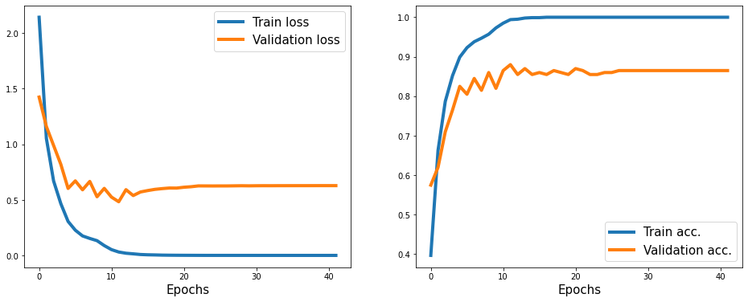

# Pytorch in depth

- [Pytorch in depth](#pytorch-in-depth)
  - [Simplifying implementations of common architectures via the torch.nn module](#simplifying-implementations-of-common-architectures-via-the-torchnn-module)
    - [Implementing models based on `nn.Sequential`](#implementing-models-based-on-nnsequential)
  - [Making model building more flexible with `nn.Module`](#making-model-building-more-flexible-with-nnmodule)
    - [example 2](#example-2)
  - [Writing custom layers in PyTorch](#writing-custom-layers-in-pytorch)
  - [Project one – Linear Regression](#project-one--linear-regression)
    - [Data preprocessing, feature engineering](#data-preprocessing-feature-engineering)
    - [Training a DNN regression model](#training-a-dnn-regression-model)
  - [Project two : classifying MNIST hand-written digits](#project-two--classifying-mnist-hand-written-digits)

<a href="https://colab.research.google.com/github/dev-SR/Deep-Learning/blob/main/02-pytorch-workflow-classification/torch_workflow.ipynb" target="_parent"></a>


```python
"""
cd 03-pytorch-in-depth
jupyter nbconvert --to markdown torch_workflow.ipynb --output README.md
"""
import numpy as np
import pandas as pd
import matplotlib.pyplot as plt
import torch  # noqa: E402
import torch.nn as nn
import torch.nn.functional as F
from torch.utils.data import DataLoader, TensorDataset
from torch.optim.lr_scheduler import ReduceLROnPlateau

from sklearn.model_selection import train_test_split
from sklearn.preprocessing import StandardScaler

from mlxtend.plotting import plot_decision_regions

import sys

sys.path.append("..")  # Add the parent directory to the path
from global_helpers import (  # noqa: E402
    generate_blob_cluster,
    generate_xor_data,
)
```

## Simplifying implementations of common architectures via the torch.nn module


You have already seen some examples of building a feedforward NN model (for instance, a multilayer
perceptron) and defining a sequence of layers using the `nn.Module` class. Before we take a deeper dive
into `nn.Module`, let’s briefly look at another approach for conjuring those layers via `nn.Sequential`.


### Implementing models based on `nn.Sequential`


With `nn.Sequential` the layers stored inside the model are connected in a cascaded way.


```python
model = nn.Sequential(
    nn.Linear(2, 10),
    nn.Sigmoid(),
    nn.Linear(10, 6),
    nn.Sigmoid(),
    nn.Linear(6, 2),
)
loss_fn = nn.CrossEntropyLoss()
optimizer = torch.optim.SGD(model.parameters(), lr=0.01)
model
```


    Sequential(
      (0): Linear(in_features=2, out_features=10, bias=True)
      (1): Sigmoid()
      (2): Linear(in_features=10, out_features=6, bias=True)
      (3): Sigmoid()
      (4): Linear(in_features=6, out_features=2, bias=True)
    )


```python
X_train, X_test, y_train, y_test = generate_blob_cluster(split_train_test=True)
X_train, X_test, y_train, y_test = (
    torch.tensor(X_train).float(),
    torch.tensor(X_test).float(),
    torch.tensor(y_train).float(),
    torch.tensor(y_test).float(),
)
n_train = len(X_train)
```

    (1000, 2) (1000,)


```python
train_ds = TensorDataset(X_train, y_train)
batch_size = 20
torch.manual_seed(1)
train_dl = DataLoader(train_ds, batch_size, shuffle=True)
```


```python
def train(model, num_epochs, train_dl, x_valid, y_valid, log_epochs=10):
    loss_hist_train = [0] * num_epochs
    accuracy_hist_train = [0] * num_epochs
    loss_hist_valid = [0] * num_epochs
    accuracy_hist_valid = [0] * num_epochs
    for epoch in range(num_epochs):
        for x_batch, y_batch in train_dl:
            optimizer.zero_grad()
            pred = model(x_batch)
            loss = loss_fn(pred, y_batch.long())
            loss.backward()
            optimizer.step()
            loss_hist_train[epoch] += loss.item()
            is_correct = (torch.argmax(pred, axis=1) == y_batch).float()
            accuracy_hist_train[epoch] += is_correct.mean()

        loss_hist_train[epoch] /= n_train / batch_size
        accuracy_hist_train[epoch] /= n_train / batch_size

        pred = model(x_valid)
        loss = loss_fn(pred, y_valid.long())
        loss_hist_valid[epoch] = loss.item()
        is_correct = (torch.argmax(pred, axis=1) == y_valid).float()
        accuracy_hist_valid[epoch] += is_correct.mean()
        # Logging
        if epoch % log_epochs == 0:
            print(f"Epoch [{epoch + 1}/{num_epochs}], Loss: {loss.item()}")
    return {
        "loss_train": loss_hist_train,
        "loss_valid": loss_hist_valid,
        "accuracy_train": accuracy_hist_train,
        "accuracy_valid": accuracy_hist_valid,
    }
```


```python
torch.manual_seed(1)
num_epochs = 200
log_epochs = 39
history = train(model, num_epochs, train_dl, X_test, y_test, log_epochs=log_epochs)
```

    Epoch [1/200], Loss: 0.6650936603546143
    Epoch [40/200], Loss: 0.3103216886520386
    Epoch [79/200], Loss: 0.12023929506540298
    Epoch [118/200], Loss: 0.08938241004943848
    Epoch [157/200], Loss: 0.07876066118478775
    Epoch [196/200], Loss: 0.07173140347003937


```python
fig = plt.figure(figsize=(16, 4))
ax = fig.add_subplot(1, 2, 1)
plt.plot(history["loss_train"], lw=4)
plt.plot(history["loss_valid"], lw=4)
plt.legend(["Train loss", "Validation loss"], fontsize=15)
ax.set_xlabel("Epochs", size=15)

ax = fig.add_subplot(1, 2, 2)
plt.plot(history["accuracy_train"], lw=4)
plt.plot(history["accuracy_valid"], lw=4)
plt.legend(["Train acc.", "Validation acc."], fontsize=15)
ax.set_xlabel("Epochs", size=15)

# plt.savefig('figures/13_03.png', dpi=300)
```


    Text(0.5, 0, 'Epochs')





## Making model building more flexible with `nn.Module`


In the previous example, we used the PyTorch Sequential class to create a fully connected NN with
multiple layers. This is a very common and convenient way of building models. However, it unfortunately
doesn’t allow us to create more complex models that have multiple input, output, or intermediate
branches. That’s where `nn.Module` comes in handy.


The alternative way to build complex models is by subclassing nn.Module. In this approach, we create a
new class derived from nn.Module and define the method, `__init__()`, as a constructor. The `forward()`
method is used to specify the forward pass. In the constructor function, `__init__()`, we define the
layers as attributes of the class so that they can be accessed via the self reference attribute. Then, in
the `forward()` method, we specify how these layers are to be used in the forward pass of the NN. The
code for defining a new class that implements the previous model is as follows:


```python
class MyModule(nn.Module):
    def __init__(self):
        super().__init__()
        l1 = nn.Linear(2, 10)
        a1 = nn.Sigmoid()
        l2 = nn.Linear(10, 6)
        a2 = nn.Sigmoid()
        l3 = nn.Linear(6, 2)
        l = [l1, a1, l2, a2, l3]
        self.module_list = nn.ModuleList(l)

    def forward(self, x):
        for f in self.module_list:
            x = f(x)
        return x

    def predict(self, x):
        x = torch.tensor(x, dtype=torch.float32)
        pred = self.forward(x)
        return torch.argmax(pred, axis=1)
```

Notice that we put all layers in the nn.ModuleList object, which is just a list object composed of
nn.Module items. This makes the code more readable and easier to follow:


```python
model = MyModule()
model
```


    MyModule(
      (module_list): ModuleList(
        (0): Linear(in_features=2, out_features=10, bias=True)
        (1): Sigmoid()
        (2): Linear(in_features=10, out_features=6, bias=True)
        (3): Sigmoid()
        (4): Linear(in_features=6, out_features=2, bias=True)
      )
    )


**Next, besides the train history, we will use the `mlxtend` library to visualize the validation data and
the decision boundary. To compute the decision boundary of our model, we also need to add a `predict()` method in the `MyModule` class.**


```python
loss_fn = nn.CrossEntropyLoss()
optimizer = torch.optim.SGD(model.parameters(), lr=0.01)

# torch.manual_seed(1)
history = train(model, num_epochs, train_dl, X_test, y_test)
```

    Epoch [1/200], Loss: 0.7060620784759521
    Epoch [40/200], Loss: 0.4935990869998932
    Epoch [79/200], Loss: 0.16367541253566742
    Epoch [118/200], Loss: 0.09916793555021286
    Epoch [157/200], Loss: 0.08117182552814484
    Epoch [196/200], Loss: 0.0719602182507515


```python
plot_decision_regions(X=X_test.numpy(), y=y_test.numpy().astype(np.int64), clf=model)
```


    <AxesSubplot:>





### example 2


```python
X_train, X_test, y_train, y_test = generate_xor_data(split_train_test=True)
X_train, X_test, y_train, y_test = (
    torch.tensor(X_train).float(),
    torch.tensor(X_test).float(),
    torch.tensor(y_train).float(),
    torch.tensor(y_test).float(),
)
n_train = len(X_train)
train_ds = TensorDataset(X_train, y_train)
batch_size = 20
torch.manual_seed(1)
train_dl = DataLoader(train_ds, batch_size, shuffle=True)
```





```python
model = MyModule()
loss_fn = nn.CrossEntropyLoss()
optimizer = torch.optim.Adam(model.parameters(), lr=0.015)
# torch.manual_seed(1)
history = train(model, 100, train_dl, X_test, y_test)
```

    Epoch [1/100], Loss: 0.6937592625617981
    Epoch [11/100], Loss: 0.30175235867500305
    Epoch [21/100], Loss: 0.08801449835300446
    Epoch [31/100], Loss: 0.05076465755701065
    Epoch [41/100], Loss: 0.04663023352622986
    Epoch [51/100], Loss: 0.03594113513827324
    Epoch [61/100], Loss: 0.0778207778930664
    Epoch [71/100], Loss: 0.03195153549313545
    Epoch [81/100], Loss: 0.035697661340236664
    Epoch [91/100], Loss: 0.032447706907987595


```python
plot_decision_regions(X=X_test.numpy(), y=y_test.numpy().astype(np.int64), clf=model)
```


    <AxesSubplot:>





## Writing custom layers in PyTorch


Creating custom layers in PyTorch involves defining a class inherited from `nn.Module`. This allows us to craft our own layer functionalities. Say, we want a unique noisy linear layer that computes $w \cdot (x + \epsilon) + b$, where $\epsilon$ signifies a random variable. To do this, we create a class, typically specifying the constructor `__init__()` and the `forward()` method. The constructor sets up the necessary tensors and variables for the layer, initializing them based on given input size or postponing initialization if the input shape isn't known upfront. As an example, let's craft a layer named `NoisyLinear` to carry out the computation mentioned earlier.


```python
class NoisyLinear(nn.Module):
    def __init__(self, input_features, output_features, noise_stddev=0.1):
        super().__init__()
        w = torch.Tensor(output_features, input_features)
        # nn.Parameter is a Tensor that's a module parameter.
        self.w = nn.Parameter(w)
        nn.init.xavier_uniform_(self.w)
        b = torch.Tensor(output_features).fill_(0)
        self.b = nn.Parameter(b)
        self.noise_stddev = noise_stddev

    def forward(self, x, training=False):
        if training:
            noise = torch.normal(0.0, self.noise_stddev, x.shape)
            x_new = torch.add(x, noise)
        else:
            x_new = x
        return torch.add(torch.mm(x_new, self.w.t()), self.b)

    def __repr__(self):
        return (
            "NoisyLinear(in_features="
            + str(self.w.shape[1])
            + ", out_features="
            + str(self.w.shape[0])
            + ", bias="
            + str(self.b is not None)
            + ")"
        )
```


```python
torch.manual_seed(1)

noisy_layer = NoisyLinear(input_features=2, output_features=3)

x = torch.zeros((1, 2))
print(noisy_layer(x, training=True))

print(noisy_layer(x, training=True))

print(noisy_layer(x, training=False))
```

    tensor([[-0.0235,  0.0468,  0.0170]], grad_fn=<AddBackward0>)
    tensor([[ 0.0144,  0.0180, -0.0422]], grad_fn=<AddBackward0>)
    tensor([[0., 0., 0.]], grad_fn=<AddBackward0>)


Now, let’s create a new model similar to the previous one for solving the XOR classification task.
As before, we will use the nn.Module class for model building, but this time, we will use our
`NoisyLinear` layer as the first hidden layer of the multilayer perceptron. The code is as follows:


```python
class MyNoisyModule(nn.Module):
    def __init__(self):
        super().__init__()
        self.l1 = NoisyLinear(2, 10, 0.07)
        self.a1 = nn.Sigmoid()
        self.l2 = nn.Linear(10, 6)
        self.a2 = nn.Sigmoid()
        self.l3 = nn.Linear(6, 2)

    def forward(self, x, training=False):
        x = self.l1(x, training)
        x = self.a1(x)
        x = self.l2(x)
        x = self.a2(x)
        x = self.l3(x)
        return x

    def predict(self, x):
        x = torch.tensor(x, dtype=torch.float32)
        pred = self.forward(x)
        return torch.argmax(pred, axis=1)


torch.manual_seed(1)
model = MyNoisyModule()
optimizer = torch.optim.Adam(model.parameters(), lr=0.015)
model
```


    MyNoisyModule(
      (l1): NoisyLinear(in_features=2, out_features=10, bias=True)
      (a1): Sigmoid()
      (l2): Linear(in_features=10, out_features=6, bias=True)
      (a2): Sigmoid()
      (l3): Linear(in_features=6, out_features=2, bias=True)
    )


```python
torch.manual_seed(1)
num_epochs = 200
log_epochs = 39


def train(model, num_epochs, train_dl, x_valid, y_valid, log_epochs=10):
    loss_hist_train = [0] * num_epochs
    accuracy_hist_train = [0] * num_epochs
    loss_hist_valid = [0] * num_epochs
    accuracy_hist_valid = [0] * num_epochs
    for epoch in range(num_epochs):
        for x_batch, y_batch in train_dl:
            optimizer.zero_grad()
            ########! setting training=True to add noise ########
            pred = model(x_batch, training=True)
            loss = loss_fn(pred, y_batch.long())
            loss.backward()
            optimizer.step()
            loss_hist_train[epoch] += loss.item()
            is_correct = (torch.argmax(pred, axis=1) == y_batch).float()
            accuracy_hist_train[epoch] += is_correct.mean()

        loss_hist_train[epoch] /= n_train / batch_size
        accuracy_hist_train[epoch] /= n_train / batch_size

        pred = model(x_valid, training=False)
        loss = loss_fn(pred, y_valid.long())
        loss_hist_valid[epoch] = loss.item()
        is_correct = (torch.argmax(pred, axis=1) == y_valid).float()
        accuracy_hist_valid[epoch] += is_correct.mean()
        # Logging
        if epoch % log_epochs == 0:
            print(f"Epoch [{epoch + 1}/{num_epochs}], Loss: {loss.item()}")
    return {
        "loss_train": loss_hist_train,
        "loss_valid": loss_hist_valid,
        "accuracy_train": accuracy_hist_train,
        "accuracy_valid": accuracy_hist_valid,
    }


history = train(
    model,
    num_epochs=num_epochs,
    train_dl=train_dl,
    x_valid=X_test,
    y_valid=y_test,
    log_epochs=log_epochs,
)
```

    Epoch [1/200], Loss: 0.6921265125274658
    Epoch [40/200], Loss: 0.10089663416147232
    Epoch [79/200], Loss: 0.07622559368610382
    Epoch [118/200], Loss: 0.06156187877058983
    Epoch [157/200], Loss: 0.05972304567694664
    Epoch [196/200], Loss: 0.06177102401852608


```python
fig = plt.figure(figsize=(16, 4))
ax = fig.add_subplot(1, 3, 1)
plt.plot(history["loss_train"], lw=4)
plt.plot(history["loss_valid"], lw=4)
plt.legend(["Train loss", "Validation loss"], fontsize=15)
ax.set_xlabel("Epochs", size=15)

ax = fig.add_subplot(1, 3, 2)
plt.plot(history["accuracy_train"], lw=4)
plt.plot(history["accuracy_valid"], lw=4)
plt.legend(["Train acc.", "Validation acc."], fontsize=15)
ax.set_xlabel("Epochs", size=15)

ax = fig.add_subplot(1, 3, 3)
plot_decision_regions(X=X_test.numpy(), y=y_test.numpy().astype(np.int64), clf=model)
ax.set_xlabel(r"$x_1$", size=15)
ax.xaxis.set_label_coords(1, -0.025)
ax.set_ylabel(r"$x_2$", size=15)
ax.yaxis.set_label_coords(-0.025, 1)

# plt.savefig('figures/13_06.png', dpi=300)
plt.show()
```





## Project one – Linear Regression


In this section, we will work on a real-world project of predicting the fuel efficiency of a car in miles per gallon (MPG). We will cover the underlying steps in machine learning tasks, such as data preprocessing, feature engineering, training, prediction (inference), and evaluation.


### Data preprocessing, feature engineering


```python
url = "http://archive.ics.uci.edu/ml/machine-learning-databases/auto-mpg/auto-mpg.data"
column_names = [
    "MPG",
    "Cylinders",
    "Displacement",
    "Horsepower",
    "Weight",
    "Acceleration",
    "Model Year",
    "Origin",
]

df = pd.read_csv(
    url, names=column_names, na_values="?", comment="\t", sep=" ", skipinitialspace=True
)

df.tail()
```


<div>

<table border="1" class="dataframe">
  <thead>
    <tr style="text-align: right;">
      <th></th>
      <th>MPG</th>
      <th>Cylinders</th>
      <th>Displacement</th>
      <th>Horsepower</th>
      <th>Weight</th>
      <th>Acceleration</th>
      <th>Model Year</th>
      <th>Origin</th>
    </tr>
  </thead>
  <tbody>
    <tr>
      <th>393</th>
      <td>27.0</td>
      <td>4</td>
      <td>140.0</td>
      <td>86.0</td>
      <td>2790.0</td>
      <td>15.6</td>
      <td>82</td>
      <td>1</td>
    </tr>
    <tr>
      <th>394</th>
      <td>44.0</td>
      <td>4</td>
      <td>97.0</td>
      <td>52.0</td>
      <td>2130.0</td>
      <td>24.6</td>
      <td>82</td>
      <td>2</td>
    </tr>
    <tr>
      <th>395</th>
      <td>32.0</td>
      <td>4</td>
      <td>135.0</td>
      <td>84.0</td>
      <td>2295.0</td>
      <td>11.6</td>
      <td>82</td>
      <td>1</td>
    </tr>
    <tr>
      <th>396</th>
      <td>28.0</td>
      <td>4</td>
      <td>120.0</td>
      <td>79.0</td>
      <td>2625.0</td>
      <td>18.6</td>
      <td>82</td>
      <td>1</td>
    </tr>
    <tr>
      <th>397</th>
      <td>31.0</td>
      <td>4</td>
      <td>119.0</td>
      <td>82.0</td>
      <td>2720.0</td>
      <td>19.4</td>
      <td>82</td>
      <td>1</td>
    </tr>
  </tbody>
</table>
</div>


```python
print(df.isna().sum())

df = df.dropna()
df = df.reset_index(drop=True)
df.tail()
```

    MPG             0
    Cylinders       0
    Displacement    0
    Horsepower      6
    Weight          0
    Acceleration    0
    Model Year      0
    Origin          0
    dtype: int64


<div>

<table border="1" class="dataframe">
  <thead>
    <tr style="text-align: right;">
      <th></th>
      <th>MPG</th>
      <th>Cylinders</th>
      <th>Displacement</th>
      <th>Horsepower</th>
      <th>Weight</th>
      <th>Acceleration</th>
      <th>Model Year</th>
      <th>Origin</th>
    </tr>
  </thead>
  <tbody>
    <tr>
      <th>387</th>
      <td>27.0</td>
      <td>4</td>
      <td>140.0</td>
      <td>86.0</td>
      <td>2790.0</td>
      <td>15.6</td>
      <td>82</td>
      <td>1</td>
    </tr>
    <tr>
      <th>388</th>
      <td>44.0</td>
      <td>4</td>
      <td>97.0</td>
      <td>52.0</td>
      <td>2130.0</td>
      <td>24.6</td>
      <td>82</td>
      <td>2</td>
    </tr>
    <tr>
      <th>389</th>
      <td>32.0</td>
      <td>4</td>
      <td>135.0</td>
      <td>84.0</td>
      <td>2295.0</td>
      <td>11.6</td>
      <td>82</td>
      <td>1</td>
    </tr>
    <tr>
      <th>390</th>
      <td>28.0</td>
      <td>4</td>
      <td>120.0</td>
      <td>79.0</td>
      <td>2625.0</td>
      <td>18.6</td>
      <td>82</td>
      <td>1</td>
    </tr>
    <tr>
      <th>391</th>
      <td>31.0</td>
      <td>4</td>
      <td>119.0</td>
      <td>82.0</td>
      <td>2720.0</td>
      <td>19.4</td>
      <td>82</td>
      <td>1</td>
    </tr>
  </tbody>
</table>
</div>


Partitioning the dataset into training and test datasets


```python
df_train, df_test = train_test_split(df, train_size=0.8, random_state=1)
train_stats = df_train.describe().transpose()
train_stats
```


<div>

<table border="1" class="dataframe">
  <thead>
    <tr style="text-align: right;">
      <th></th>
      <th>count</th>
      <th>mean</th>
      <th>std</th>
      <th>min</th>
      <th>25%</th>
      <th>50%</th>
      <th>75%</th>
      <th>max</th>
    </tr>
  </thead>
  <tbody>
    <tr>
      <th>MPG</th>
      <td>313.0</td>
      <td>23.404153</td>
      <td>7.666909</td>
      <td>9.0</td>
      <td>17.5</td>
      <td>23.0</td>
      <td>29.0</td>
      <td>46.6</td>
    </tr>
    <tr>
      <th>Cylinders</th>
      <td>313.0</td>
      <td>5.402556</td>
      <td>1.701506</td>
      <td>3.0</td>
      <td>4.0</td>
      <td>4.0</td>
      <td>8.0</td>
      <td>8.0</td>
    </tr>
    <tr>
      <th>Displacement</th>
      <td>313.0</td>
      <td>189.512780</td>
      <td>102.675646</td>
      <td>68.0</td>
      <td>104.0</td>
      <td>140.0</td>
      <td>260.0</td>
      <td>455.0</td>
    </tr>
    <tr>
      <th>Horsepower</th>
      <td>313.0</td>
      <td>102.929712</td>
      <td>37.919046</td>
      <td>46.0</td>
      <td>75.0</td>
      <td>92.0</td>
      <td>120.0</td>
      <td>230.0</td>
    </tr>
    <tr>
      <th>Weight</th>
      <td>313.0</td>
      <td>2961.198083</td>
      <td>848.602146</td>
      <td>1613.0</td>
      <td>2219.0</td>
      <td>2755.0</td>
      <td>3574.0</td>
      <td>5140.0</td>
    </tr>
    <tr>
      <th>Acceleration</th>
      <td>313.0</td>
      <td>15.704473</td>
      <td>2.725399</td>
      <td>8.5</td>
      <td>14.0</td>
      <td>15.5</td>
      <td>17.3</td>
      <td>24.8</td>
    </tr>
    <tr>
      <th>Model Year</th>
      <td>313.0</td>
      <td>75.929712</td>
      <td>3.675305</td>
      <td>70.0</td>
      <td>73.0</td>
      <td>76.0</td>
      <td>79.0</td>
      <td>82.0</td>
    </tr>
    <tr>
      <th>Origin</th>
      <td>313.0</td>
      <td>1.591054</td>
      <td>0.807923</td>
      <td>1.0</td>
      <td>1.0</td>
      <td>1.0</td>
      <td>2.0</td>
      <td>3.0</td>
    </tr>
  </tbody>
</table>
</div>


Standardizing the continuous features


```python
numeric_column_names = [
    "Cylinders",
    "Displacement",
    "Horsepower",
    "Weight",
    "Acceleration",
]
df_train_norm, df_test_norm = df_train.copy(), df_test.copy()

scaler = StandardScaler()
df_train_norm[numeric_column_names] = scaler.fit_transform(
    df_train[numeric_column_names]
)
df_test_norm[numeric_column_names] = scaler.transform(df_test[numeric_column_names])

df_train_norm.tail()
```


<div>

<table border="1" class="dataframe">
  <thead>
    <tr style="text-align: right;">
      <th></th>
      <th>MPG</th>
      <th>Cylinders</th>
      <th>Displacement</th>
      <th>Horsepower</th>
      <th>Weight</th>
      <th>Acceleration</th>
      <th>Model Year</th>
      <th>Origin</th>
    </tr>
  </thead>
  <tbody>
    <tr>
      <th>203</th>
      <td>28.0</td>
      <td>-0.825623</td>
      <td>-0.902462</td>
      <td>-0.737741</td>
      <td>-0.951552</td>
      <td>0.255611</td>
      <td>76</td>
      <td>3</td>
    </tr>
    <tr>
      <th>255</th>
      <td>19.4</td>
      <td>0.351689</td>
      <td>0.414463</td>
      <td>-0.341528</td>
      <td>0.293660</td>
      <td>0.549616</td>
      <td>78</td>
      <td>1</td>
    </tr>
    <tr>
      <th>72</th>
      <td>13.0</td>
      <td>1.529001</td>
      <td>1.146088</td>
      <td>0.715040</td>
      <td>1.341762</td>
      <td>-0.626404</td>
      <td>72</td>
      <td>1</td>
    </tr>
    <tr>
      <th>235</th>
      <td>30.5</td>
      <td>-0.825623</td>
      <td>-0.892707</td>
      <td>-1.054711</td>
      <td>-1.074303</td>
      <td>0.476114</td>
      <td>77</td>
      <td>1</td>
    </tr>
    <tr>
      <th>37</th>
      <td>14.0</td>
      <td>1.529001</td>
      <td>1.565553</td>
      <td>1.639537</td>
      <td>1.472775</td>
      <td>-1.361417</td>
      <td>71</td>
      <td>1</td>
    </tr>
  </tbody>
</table>
</div>


Next, let’s group the rather fine-grained model year (ModelYear) information into buckets to simplify
the learning task for the model that we are going to train later. Concretely, we are going to assign each
car into one of four year buckets, as follows:

$$
\text{bucket} = \begin{cases}
0 & \text{if } \text{year} < 73 \\
1 & \text{if } 73 \leq \text{year} < 76 \\
2 & \text{if } 76 \leq \text{year} < 79 \\
3 & \text{if } \text{year} \geq 79 \\
\end{cases}
$$


In order to group the cars into these buckets, we will first define three cut-off values: `[73, 76, 79]` for the
model year feature. These cut-off values are used to specify half-closed intervals, for instance, `(–∞, 73),
[73, 76), [76, 79), and [76, ∞)`. Then, the original numeric features will be passed to the
[`torch.bucketize`](https://pytorch.org/docs/stable/generated/torch.bucketize.html) function to generate the
indices of the buckets


```python
boundaries = torch.tensor([73, 76, 79])

v = torch.tensor(df_train_norm["Model Year"].values)
df_train_norm["Model Year Bucketed"] = torch.bucketize(v, boundaries, right=True)

v = torch.tensor(df_test_norm["Model Year"].values)
df_test_norm["Model Year Bucketed"] = torch.bucketize(v, boundaries, right=True)

numeric_column_names.append("Model Year Bucketed")
```

Next, we will proceed with defining a list for the unordered categorical feature, **Origin**. In PyTorch,
**There are two ways to work with a categorical feature**: using an embedding layer via `nn.Embedding`
(https://pytorch.org/docs/stable/generated/torch.nn.Embedding.html), or using `one-hot-encoded`
vectors (also called indicator).

In the encoding approach, for example, index 0 will be encoded as [1, 0, 0], index 1 will be encoded as [0, 1, 0], and so on. On the other hand, the embedding layer maps each index to a vector of random numbers of the type float, which can be trained. (You can think of the embedding layer as a more efficient implementation of a one-hot encoding multiplied with a trainable weight matrix.)

When the number of categories is large, using the embedding layer with fewer dimensions than the
number of categories can improve the performance.

We will use the one-hot-encoding approach on the categorical feature in order to convert it into the dense format


```python
classes = df_train_norm["Origin"].unique()
print(classes)
```

    [1 2 3]


```python
F.one_hot(torch.from_numpy(classes), num_classes=3)
```


    ---------------------------------------------------------------------------

    RuntimeError                              Traceback (most recent call last)

    <ipython-input-9-125d545a9578> in <module>
    ----> 1 F.one_hot(torch.from_numpy(classes), num_classes=3)


    RuntimeError: Class values must be smaller than num_classes.


```python
print(classes)
print(classes % len(classes))
F.one_hot(torch.from_numpy(classes % len(classes)), num_classes=3)
# The number of classes will be inferred as one greater than the largest class value in the input tensor if 'num_classes' is not given.
```

    [1 2 3]
    [1 2 0]


    tensor([[0, 1, 0],
            [0, 0, 1],
            [1, 0, 0]])


```python
total_origin = len(df_train_norm["Origin"].unique())
origin_encoded_train = F.one_hot(
    torch.from_numpy(df_train_norm["Origin"].values) % total_origin
)
origin_encoded_test = F.one_hot(
    torch.from_numpy(df_test_norm["Origin"].values) % total_origin
)
```


```python
x_train_numeric = torch.tensor(df_train_norm[numeric_column_names].values)
x_train = torch.cat([x_train_numeric, origin_encoded_train], 1).float()
x_test_numeric = torch.tensor(df_test_norm[numeric_column_names].values)
x_test = torch.cat([x_test_numeric, origin_encoded_test], 1).float()

y_train = torch.tensor(df_train_norm["MPG"].values).float()
y_test = torch.tensor(df_test_norm["MPG"].values).float()
```


```python
train_ds = TensorDataset(x_train, y_train)
batch_size = 8
torch.manual_seed(1)
train_dl = DataLoader(train_ds, batch_size, shuffle=True)
```

### Training a DNN regression model


```python
torch.manual_seed(1)

input_features = x_train.shape[1]
hidden_units = [10, 6, 4]

all_layers = []
for hidden_unit in hidden_units:
    layer = nn.Linear(input_features, hidden_unit)
    all_layers.append(layer)
    all_layers.append(nn.ReLU())
    input_features = hidden_unit

all_layers.append(nn.Linear(hidden_units[-1], 1))
model = nn.Sequential(*all_layers)
loss_fn = nn.MSELoss()
optimizer = torch.optim.SGD(model.parameters(), lr=0.001)
model
```


    Sequential(
      (0): Linear(in_features=9, out_features=10, bias=True)
      (1): ReLU()
      (2): Linear(in_features=10, out_features=6, bias=True)
      (3): ReLU()
      (4): Linear(in_features=6, out_features=4, bias=True)
      (5): ReLU()
      (6): Linear(in_features=4, out_features=1, bias=True)
    )


```python
num_epochs = 200
log_epochs = 20

for epoch in range(num_epochs):
    loss_hist_train = 0
    for x_batch, y_batch in train_dl:
        optimizer.zero_grad()
        pred = model(x_batch).squeeze(1)
        loss = loss_fn(pred, y_batch)
        loss.backward()
        optimizer.step()
        loss_hist_train += loss.item()
    if epoch % log_epochs == 0:
        print(f"Epoch {epoch}  Loss {loss_hist_train/len(train_dl):.4f}")
```

    Epoch 0  Loss 504.8686
    Epoch 20  Loss 8.2171
    Epoch 40  Loss 7.8521
    Epoch 60  Loss 7.9645
    Epoch 80  Loss 7.7267
    Epoch 100  Loss 8.3547
    Epoch 120  Loss 6.4928
    Epoch 140  Loss 6.9542
    Epoch 160  Loss 6.6513
    Epoch 180  Loss 6.4105


```python
with torch.no_grad():
    pred = model(x_test.float())[:, 0]
    loss = loss_fn(pred, y_test)
    print(f"Test MSE: {loss.item():.4f}")
    print(f"Test MAE: {nn.L1Loss()(pred, y_test).item():.4f}")
```

    Test MSE: 15.7344
    Test MAE: 2.9747


## Project two : classifying MNIST hand-written digits


```python
from datasets import load_dataset

dataset = load_dataset("mnist")
```


    Downloading builder script:   0%|          | 0.00/3.98k [00:00<?, ?B/s]


    Downloading metadata:   0%|          | 0.00/2.21k [00:00<?, ?B/s]


    Downloading readme:   0%|          | 0.00/6.83k [00:00<?, ?B/s]


    Downloading and preparing dataset mnist/mnist to C:/Users/soiko/.cache/huggingface/datasets/mnist/mnist/1.0.0/9d494b7f466d6931c64fb39d58bb1249a4d85c9eb9865d9bc20960b999e2a332...


    Downloading data files:   0%|          | 0/4 [00:00<?, ?it/s]


    Downloading data:   0%|          | 0.00/9.91M [00:00<?, ?B/s]


    Downloading data:   0%|          | 0.00/28.9k [00:00<?, ?B/s]


    Downloading data:   0%|          | 0.00/1.65M [00:00<?, ?B/s]


    Downloading data:   0%|          | 0.00/4.54k [00:00<?, ?B/s]


    Extracting data files:   0%|          | 0/4 [00:00<?, ?it/s]


    Generating train split:   0%|          | 0/60000 [00:00<?, ? examples/s]


    Generating test split:   0%|          | 0/10000 [00:00<?, ? examples/s]


    Dataset mnist downloaded and prepared to C:/Users/soiko/.cache/huggingface/datasets/mnist/mnist/1.0.0/9d494b7f466d6931c64fb39d58bb1249a4d85c9eb9865d9bc20960b999e2a332. Subsequent calls will reuse this data.


      0%|          | 0/2 [00:00<?, ?it/s]


```python
dataset["test"]["image"][0]
```


```python
from torchvision import transforms
from datasets import load_dataset
from torch.utils.data import random_split, DataLoader

# https://huggingface.co/docs/datasets/v1.11.0/splits.html
# Load the MNIST dataset
train_ds, test_ds = load_dataset("mnist", split=["train[:1000]", "test[:200]"])
print(train_ds, test_ds)
```

    Found cached dataset mnist (C:/Users/soiko/.cache/huggingface/datasets/mnist/mnist/1.0.0/9d494b7f466d6931c64fb39d58bb1249a4d85c9eb9865d9bc20960b999e2a332)


      0%|          | 0/2 [00:00<?, ?it/s]


    Dataset({
        features: ['image', 'label'],
        num_rows: 1000
    }) Dataset({
        features: ['image', 'label'],
        num_rows: 200
    })


```python
train_ds.set_format(type="torch", columns=["image", "label"])
test_ds.set_format(type="torch", columns=["image", "label"])
print(type(train_ds[0]["image"]))  # This should output <class 'torch.Tensor'>

# Extract tensors for testing
x_train = train_ds["image"].float()
y_train = train_ds["label"].long()

x_test = test_ds["image"].float()
y_test = test_ds["label"].long()
```

    <class 'torch.Tensor'>


```python
train_ds[0]["image"].dtype
```


    torch.uint8


> Note!! PyTorch initialzie linear layer by default float32 as the dtype. So input should also be float() or will get the `RuntimeError: mat1 and mat2 must have the same dtype`


```python
# Create a DataLoader
batch_size = 20
t = TensorDataset(x_train, y_train)
train_dl = DataLoader(t, batch_size=batch_size, shuffle=True)
```


```python
train_ds[0]["image"].shape
```


    torch.Size([28, 28])


```python
def make_model():
    hidden_units = [32, 16]
    image_size = train_ds[0]["image"].shape
    input_size = image_size[0] * image_size[1]
    input_size = image_size[0] * image_size[1]
    all_layers = [nn.Flatten()]

    for hidden_unit in hidden_units:
        layer = nn.Linear(input_size, hidden_unit)
        all_layers.append(layer)
        all_layers.append(nn.ReLU())
        input_size = hidden_unit

    all_layers.append(nn.Linear(hidden_units[-1], 10))
    return nn.Sequential(*all_layers)


model = make_model()
model
```


    Sequential(
      (0): Flatten(start_dim=1, end_dim=-1)
      (1): Linear(in_features=784, out_features=32, bias=True)
      (2): ReLU()
      (3): Linear(in_features=32, out_features=16, bias=True)
      (4): ReLU()
      (5): Linear(in_features=16, out_features=10, bias=True)
    )


```python
print(model[1].weight.dtype)
```

    torch.float32


```python
def plot_train_valid_history(history):
    fig = plt.figure(figsize=(16, 6))
    ax = fig.add_subplot(1, 2, 1)
    ax.plot(history["loss_train"], lw=4)
    ax.plot(history["loss_valid"], lw=4)
    ax.legend(["Train loss", "Validation loss"], fontsize=15)
    ax.set_xlabel("Epochs", size=15)

    ax = fig.add_subplot(1, 2, 2)
    ax.plot(history["accuracy_train"], lw=4)
    ax.plot(history["accuracy_valid"], lw=4)
    ax.legend(["Train acc.", "Validation acc."], fontsize=15)
    ax.set_xlabel("Epochs", size=15)
    plt.show()
```


```python
# https://github.com/rasbt/machine-learning-book/blob/main/ch13/ch13_part1.py


def train_model(
    model,
    num_epochs,
    train_dl,
    x_valid,
    y_valid,
    optimizer,
    loss_fn,
    scheduler=None,
    log_epochs=10,
    early_stop=30,
):
    # Define accuracy function
    def accuracy(logits, targets):
        predicted_labels = torch.argmax(logits, dim=1)
        return (predicted_labels == targets).float().mean()

    best_valid_loss = float("inf")
    early_stop_counter = 0

    history = {
        "loss_train": [],
        "loss_valid": [],
        "accuracy_train": [],
        "accuracy_valid": [],
    }

    for epoch in range(num_epochs):
        train_loss = 0.0
        train_acc = 0.0
        model.train()

        for x_batch, y_batch in train_dl:
            optimizer.zero_grad()
            pred = model(x_batch)
            loss = loss_fn(pred, y_batch)
            loss.backward()
            optimizer.step()
            # accumulate batch-wise for current epoch
            train_loss += loss.item()
            train_acc += accuracy(pred, y_batch)

        # avg loss, acc
        train_loss /= len(train_dl)
        train_acc /= len(train_dl)
        # Here, len(train_dl) = len(train_dl.dataset) / train_dl.batch_size
        history["loss_train"].append(train_loss)
        history["accuracy_train"].append(train_acc)

        model.eval()
        with torch.no_grad():
            pred_valid = model(x_valid)
            valid_loss = loss_fn(pred_valid, y_valid)
            valid_acc = accuracy(pred_valid, y_valid)
            history["loss_valid"].append(valid_loss.item())
            history["accuracy_valid"].append(valid_acc)

            if scheduler:
                scheduler.step(valid_loss)

            if valid_loss < best_valid_loss:
                best_valid_loss = valid_loss
                # Save the model checkpoint
                # torch.save(model.state_dict(), "best_model.pth")
                early_stop_counter = 0
            else:
                early_stop_counter += 1
            if early_stop_counter >= early_stop:
                print("Early stopping triggered!")
                break

        if epoch % log_epochs == 0:
            print(
                f"Epoch [{epoch + 1}/{num_epochs}], Train Loss: {train_loss:.4f}, Train Acc: {train_acc:.4f}, Valid Loss: {valid_loss:.4f}, Valid Acc: {valid_acc:.4f}"
            )

    return history


# Usage Example:
torch.manual_seed(1)
model = make_model()
optimizer = torch.optim.Adam(model.parameters(), lr=0.001)
scheduler = ReduceLROnPlateau(
    optimizer, mode="min", patience=10, factor=0.1, verbose=True
)
loss_fn = nn.CrossEntropyLoss()

history = train_model(
    model,
    num_epochs=200,
    train_dl=train_dl,
    x_valid=x_test,
    y_valid=y_test,
    optimizer=optimizer,
    loss_fn=loss_fn,
    scheduler=scheduler,
)
```

    Epoch [1/200], Train Loss: 2.1428, Train Acc: 0.3970, Valid Loss: 1.4248, Valid Acc: 0.5750
    Epoch [11/200], Train Loss: 0.0533, Train Acc: 0.9850, Valid Loss: 0.5256, Valid Acc: 0.8650
    Epoch [21/200], Train Loss: 0.0023, Train Acc: 1.0000, Valid Loss: 0.6143, Valid Acc: 0.8700
    Epoch 00023: reducing learning rate of group 0 to 1.0000e-04.
    Epoch [31/200], Train Loss: 0.0015, Train Acc: 1.0000, Valid Loss: 0.6277, Valid Acc: 0.8650
    Epoch 00034: reducing learning rate of group 0 to 1.0000e-05.
    Epoch [41/200], Train Loss: 0.0015, Train Acc: 1.0000, Valid Loss: 0.6287, Valid Acc: 0.8650
    Early stopping triggered!


```python
plot_train_valid_history(history=history)
```




