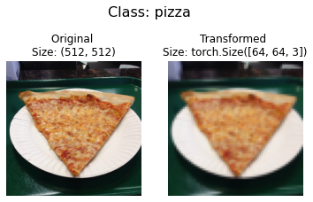
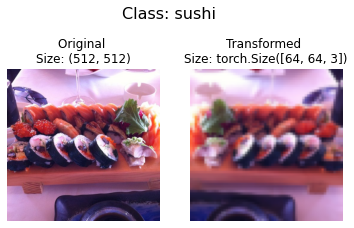
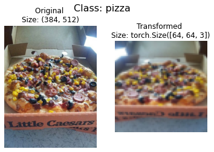
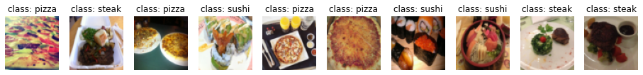

# Custom Dataset Preparation with PyTorch

- [Custom Dataset Preparation with PyTorch](#custom-dataset-preparation-with-pytorch)
  - [Image Data](#image-data)
    - [Get data](#get-data)
        - [Visualize an image](#visualize-an-image)
    - [Transforming data](#transforming-data)
    - [Option 1: Loading Image Data Using `ImageFolder`](#option-1-loading-image-data-using-imagefolder)
      - [Turn loaded images into `DataLoader`](#turn-loaded-images-into-dataloader)
    - [Option 2: Loading Image Data with a Custom Dataset](#option-2-loading-image-data-with-a-custom-dataset)
      - [Cnreate a function to display random images](#cnreate-a-function-to-display-random-images)
      - [Turn custom loaded images into DataLoader](#turn-custom-loaded-images-into-dataloader)
  - [Text Data](#text-data)

```python
"""
cd .\05-custom-dataset-pytorch\
jupyter nbconvert --to markdown custom-dataset-pythoch.ipynb --output README.md
"""

import math
import numpy as np
import matplotlib.pyplot as plt
import matplotlib

import torch
import torch.nn.functional as Fn
import torch.nn as nn
```


```python
# Setup device-agnostic code
device = "cuda" if torch.cuda.is_available() else "cpu"
device
```


    'cuda'


## Image Data

### Get data


```python
import shutil
shutil.rmtree('/content/data') #deletes a directory and all its contents.
```


```python
import requests
import zipfile
from pathlib import Path

# Setup path to data folder
data_path = Path("data/")
image_path = data_path / "pizza_steak_sushi"
zip_path = data_path / "pizza_steak_sushi.zip"
image_url = "https://github.com/mrdbourke/pytorch-deep-learning/raw/main/data/pizza_steak_sushi.zip"

# If the image folder doesn't exist, download it and prepare it...
if image_path.is_dir():
    print(f"{image_path} directory exists.")
else:
    print(f"Did not find {image_path} directory, creating one...")
    image_path.mkdir(parents=True, exist_ok=True)

    #
    # Download pizza, steak, sushi data
    with open(zip_path, "wb") as f:
        request = requests.get(image_url)
        print("Downloading pizza, steak, sushi data...")
        f.write(request.content)

    # Unzip pizza, steak, sushi data
    with zipfile.ZipFile(zip_path, "r") as zip_ref:
        print("Unzipping pizza, steak, sushi data...")
        zip_ref.extractall(image_path)

```

    Did not find data/pizza_steak_sushi directory, creating one...
    Downloading pizza, steak, sushi data...
    Unzipping pizza, steak, sushi data...


<div align="center">

</div>


```python
import os
def walk_through_dir(dir_path):
  """
  Walks through dir_path returning its contents.
  Args:
    dir_path (str or pathlib.Path): target directory

  Returns:
    A print out of:
      number of subdiretories in dir_path
      number of images (files) in each subdirectory
      name of each subdirectory
  """
  for dirpath, dirnames, filenames in os.walk(dir_path):
    print(f"There are {len(dirnames)} directories and {len(filenames)} images in '{dirpath}'.")

walk_through_dir(image_path)
```

    There are 2 directories and 0 images in 'data/pizza_steak_sushi'.
    There are 3 directories and 0 images in 'data/pizza_steak_sushi/train'.
    There are 0 directories and 72 images in 'data/pizza_steak_sushi/train/sushi'.
    There are 0 directories and 75 images in 'data/pizza_steak_sushi/train/steak'.
    There are 0 directories and 78 images in 'data/pizza_steak_sushi/train/pizza'.
    There are 3 directories and 0 images in 'data/pizza_steak_sushi/test'.
    There are 0 directories and 31 images in 'data/pizza_steak_sushi/test/sushi'.
    There are 0 directories and 19 images in 'data/pizza_steak_sushi/test/steak'.
    There are 0 directories and 25 images in 'data/pizza_steak_sushi/test/pizza'.


```python
# Setup train and testing paths
train_dir = image_path / "train"
test_dir = image_path / "test"

train_dir, test_dir
```


    (PosixPath('data/pizza_steak_sushi/train'),
     PosixPath('data/pizza_steak_sushi/test'))


##### Visualize an image


```python

```


    PosixPath('data/pizza_steak_sushi/train/sushi')


```python
import random
from PIL import Image

# Set seed
random.seed(0)

# 1. Get all image paths (* means "any combination")
image_path_list = list(image_path.glob("*/*/*.jpg"))

# 2. Get random image path
random_image_path = random.choice(image_path_list)

# 3. Get image class from path name (the image class is the name of the directory where the image is stored)
image_class = random_image_path.parent.stem
print(random_image_path,random_image_path.parent)

# 4. Open image
img = Image.open(random_image_path)

# 5. Print metadata
print(f"Random image path: {random_image_path}")
print(f"Image class: {image_class}")
print(f"Image height: {img.height}")
print(f"Image width: {img.width}")
img
```

    data/pizza_steak_sushi/train/pizza/1968947.jpg data/pizza_steak_sushi/train/pizza
    Random image path: data/pizza_steak_sushi/train/pizza/1968947.jpg
    Image class: pizza
    Image height: 512
    Image width: 512


### Transforming data


```python
import torch
from torch.utils.data import DataLoader
from torchvision import datasets, transforms
```

`torchvision.transforms` contains many pre-built methods for formatting images, turning them into tensors and even manipulating them for **data augmentation** (the practice of altering data to make it harder for a model to learn, we'll see this later on) purposes .

To get experience with torchvision.transforms, let's write a series of transform steps that:

- Resize the images using `transforms.Resize()` (from about 512x512 to 64x64, the same shape as the images on the CNN Explainer website).
= Flip our images randomly on the horizontal using `transforms.RandomHorizontalFlip()` (this could be considered a form of data augmentation because it will artificially change our image data).
- Turn our images from a `PIL` image to a PyTorch tensor using `transforms.ToTensor()`.


```python
# Write transform for image
data_transform = transforms.Compose([
    # Resize the images to 64x64
    transforms.Resize(size=(64, 64)),
    # Flip the images randomly on the horizontal
    transforms.RandomHorizontalFlip(p=0.5), # p = probability of flip, 0.5 = 50% chance
    # Turn the image into a torch.Tensor
    transforms.ToTensor() # this also converts all pixel values from 0 to 255 to be between 0.0 and 1.0
])
```


```python
def plot_transformed_images(image_paths, transform, n=3, seed=10):
    """Plots a series of random images from image_paths.

    Will open n image paths from image_paths, transform them
    with transform and plot them side by side.

    Args:
        image_paths (list): List of target image paths.
        transform (PyTorch Transforms): Transforms to apply to images.
        n (int, optional): Number of images to plot. Defaults to 3.
        seed (int, optional): Random seed for the random generator. Defaults to 42.
    """
    random.seed(seed)
    random_image_paths = random.sample(image_paths, k=n)
    for image_path in random_image_paths:
        with Image.open(image_path) as f:
            fig, ax = plt.subplots(1, 2)
            ax[0].imshow(f)
            ax[0].set_title(f"Original \nSize: {f.size}")
            ax[0].axis("off")

            # Transform and plot image
            # Note: permute() will change shape of image to suit matplotlib
            # (PyTorch default is [C, H, W] but Matplotlib is [H, W, C])
            transformed_image = transform(f).permute(1, 2, 0)
            ax[1].imshow(transformed_image)
            ax[1].set_title(f"Transformed \nSize: {transformed_image.shape}")
            ax[1].axis("off")

            fig.suptitle(f"Class: {image_path.parent.stem}", fontsize=16)

plot_transformed_images(image_path_list,
                        transform=data_transform,
                        n=3)
```











### Option 1: Loading Image Data Using `ImageFolder`

Alright, time to turn our image data into a Dataset capable of being used with PyTorch.

Since our data is in standard image classification format, we can use the class `torchvision.datasets.ImageFolder.`

Where we can pass it the file path of a target image directory as well as a series of transforms we'd like to perform on our images.

Let's test it out on our data folders `train_dir` and `test_dir` passing in `transform=data_transform` to turn our images into tensors.


```python
# Use ImageFolder to create dataset(s)
from torchvision import datasets
train_data = datasets.ImageFolder(root=train_dir, # target folder of images
                                  transform=data_transform, # transforms to perform on data (images)
                                  target_transform=None) # transforms to perform on labels (if necessary)

test_data = datasets.ImageFolder(root=test_dir,
                                 transform=data_transform)

print(f"Train data:\n{train_data}\nTest data:\n{test_data}")
```

    Train data:
    Dataset ImageFolder
        Number of datapoints: 225
        Root location: data/pizza_steak_sushi/train
        StandardTransform
    Transform: Compose(
                   Resize(size=(64, 64), interpolation=bilinear, max_size=None, antialias=None)
                   RandomHorizontalFlip(p=0.5)
                   ToTensor()
               )
    Test data:
    Dataset ImageFolder
        Number of datapoints: 75
        Root location: data/pizza_steak_sushi/test
        StandardTransform
    Transform: Compose(
                   Resize(size=(64, 64), interpolation=bilinear, max_size=None, antialias=None)
                   RandomHorizontalFlip(p=0.5)
                   ToTensor()
               )


```python
# Get class names as a list
class_names = train_data.classes
class_names
```


    ['pizza', 'steak', 'sushi']


```python
# Can also get class names as a dict
class_dict = train_data.class_to_idx
class_dict
```


    {'pizza': 0, 'steak': 1, 'sushi': 2}


```python
# Check the lengths
len(train_data), len(test_data)
```


    (225, 75)


#### Turn loaded images into `DataLoader`


```python
# Turn train and test Datasets into DataLoaders
from torch.utils.data import DataLoader
train_dataloader = DataLoader(dataset=train_data,
                              batch_size=1, # how many samples per batch?
                              num_workers=1, # how many subprocesses to use for data loading? (higher = more)
                              shuffle=True) # shuffle the data?

test_dataloader = DataLoader(dataset=test_data,
                             batch_size=1,
                             num_workers=1,
                             shuffle=False) # don't usually need to shuffle testing data


```


```python
img, label = next(iter(train_dataloader))

# Batch size will now be 1, try changing the batch_size parameter above and see what happens
print(f"Image shape: {img.shape} -> [batch_size, color_channels, height, width]")
print(f"Label shape: {label.shape}")
```

    Image shape: torch.Size([1, 3, 64, 64]) -> [batch_size, color_channels, height, width]
    Label shape: torch.Size([1])


### Option 2: Loading Image Data with a Custom Dataset


```python
import os
import pathlib
import torch

from PIL import Image
from torch.utils.data import Dataset
from torchvision import transforms
from typing import Tuple, Dict, List

# Augment train data
train_transforms = transforms.Compose([
    transforms.Resize((64, 64)),
    transforms.RandomHorizontalFlip(p=0.5),
    transforms.ToTensor()
])

# Don't augment test data, only reshape
test_transforms = transforms.Compose([
    transforms.Resize((64, 64)),
    transforms.ToTensor()
])
```

Remember how our instances of torchvision.datasets.`ImageFolder()` allowed us to use the `classes` and `class_to_idx` attributes?


```python
# Instance of torchvision.datasets.ImageFolder()
train_data.classes, train_data.class_to_idx
```


    (['pizza', 'steak', 'sushi'], {'pizza': 0, 'steak': 1, 'sushi': 2})


```python
# Make function to find classes in target directory
def find_classes(directory: str) -> Tuple[List[str], Dict[str, int]]:
    """Finds the class folder names in a target directory.

    Assumes target directory is in standard image classification format.

    Args:
        directory (str): target directory to load classnames from.

    Returns:
        Tuple[List[str], Dict[str, int]]: (list_of_class_names, dict(class_name: idx...))

    Example:
        find_classes("food_images/train")
        >>> (["class_1", "class_2"], {"class_1": 0, ...})
    """
    # 1. Get the class names by scanning the target directory
    classes = sorted([entry.name for entry in os.scandir(directory) if entry.is_dir()])

    # 2. Raise an error if class names not found
    if not classes:
        raise FileNotFoundError(f"Couldn't find any classes in {directory}.")

    # 3. Crearte a dictionary of index labels (computers prefer numerical rather than string labels)
    class_to_idx = {cls_name: i for i, cls_name in enumerate(classes)}
    return classes, class_to_idx
```


```python
find_classes(train_dir)
```


    (['pizza', 'steak', 'sushi'], {'pizza': 0, 'steak': 1, 'sushi': 2})


Create a custom Dataset to replicate `ImageFolder`:

```python
class CustomDataset(Dataset):
    def __init__():
        # ...
    def __len__():
        # ...
    def __getitem__(self, idx):
        # ...

```


```python
# Write a custom dataset class (inherits from torch.utils.data.Dataset)
from torch.utils.data import Dataset

# 1. Subclass torch.utils.data.Dataset
class ImageFolderCustom(Dataset):

    # 2. Initialize with a targ_dir and transform (optional) parameter
    def __init__(self, targ_dir: str, transform=None) -> None:

        # 3. Create class attributes
        # Get all image paths
        self.paths = list(pathlib.Path(targ_dir).glob("*/*.jpg")) # note: you'd have to update this if you've got .png's or .jpeg's
        # Setup transforms
        self.transform = transform
        # Create classes and class_to_idx attributes
        self.classes, self.class_to_idx = find_classes(targ_dir)

    # 4. Make function to load images
    def load_image(self, index: int) -> Image.Image:
        "Opens an image via a path and returns it."
        image_path = self.paths[index]
        return Image.open(image_path)

    # 5. Overwrite the __len__() method (optional but recommended for subclasses of torch.utils.data.Dataset)
    def __len__(self) -> int:
        "Returns the total number of samples."
        return len(self.paths)

    # 6. Overwrite the __getitem__() method (required for subclasses of torch.utils.data.Dataset)
    def __getitem__(self, index: int) -> Tuple[torch.Tensor, int]:
        "Returns one sample of data, data and label (X, y)."
        img = self.load_image(index)
        class_name  = self.paths[index].parent.name # expects path in data_folder/class_name/image.jpeg
        class_idx = self.class_to_idx[class_name]

        # Transform if necessary
        if self.transform:
            return self.transform(img), class_idx # return data, label (X, y)
        else:
            return img, class_idx # return data, label (X, y)
```


```python
train_data_custom = ImageFolderCustom(targ_dir=train_dir,
                                      transform=train_transforms)
test_data_custom = ImageFolderCustom(targ_dir=test_dir,
                                     transform=test_transforms)
train_data_custom, test_data_custom
```


    (<__main__.ImageFolderCustom at 0x7f10c87d8cd0>,
     <__main__.ImageFolderCustom at 0x7f10c87d8dc0>)


```python
len(train_data_custom), len(test_data_custom)
```


    (225, 75)


```python
train_data_custom.classes,train_data_custom.class_to_idx
```


    (['pizza', 'steak', 'sushi'], {'pizza': 0, 'steak': 1, 'sushi': 2})


#### Cnreate a function to display random images


```python
# 1. Take in a Dataset as well as a list of class names
def display_random_images(dataset: torch.utils.data.dataset.Dataset,
                          classes: List[str] = None,
                          n: int = 10,
                          display_shape: bool = True,
                          seed: int = None):

    # 2. Adjust display if n too high
    if n > 10:
        n = 10
        display_shape = False
        print(f"For display purposes, n shouldn't be larger than 10, setting to 10 and removing shape display.")

    # 3. Set random seed
    if seed:
        random.seed(seed)

    # 4. Get random sample indexes
    random_samples_idx = random.sample(range(len(dataset)), k=n)

    # 5. Setup plot
    plt.figure(figsize=(16, 8))

    # 6. Loop through samples and display random samples
    for i, targ_sample in enumerate(random_samples_idx):
        targ_image, targ_label = dataset[targ_sample][0], dataset[targ_sample][1]

        # 7. Adjust image tensor shape for plotting: [color_channels, height, width] -> [color_channels, height, width]
        targ_image_adjust = targ_image.permute(1, 2, 0)

        # Plot adjusted samples
        plt.subplot(1, n, i+1)
        plt.imshow(targ_image_adjust)
        plt.axis("off")
        if classes:
            title = f"class: {classes[targ_label]}"
            if display_shape:
                title = title + f"\nshape: {targ_image_adjust.shape}"
        plt.title(title)
```


```python
# Display random images from ImageFolderCustom Dataset
display_random_images(train_data_custom,
                      n=12,
                      classes=class_names,
                      seed=None) # Try setting the seed for reproducible images
```

    For display purposes, n shouldn't be larger than 10, setting to 10 and removing shape display.





#### Turn custom loaded images into DataLoader


```python
# Turn train and test custom Dataset's into DataLoader's
from torch.utils.data import DataLoader
train_dataloader_custom = DataLoader(dataset=train_data_custom, # use custom created train Dataset
                                     batch_size=1, # how many samples per batch?
                                     num_workers=0, # how many subprocesses to use for data loading? (higher = more)
                                     shuffle=True) # shuffle the data?

test_dataloader_custom = DataLoader(dataset=test_data_custom, # use custom created test Dataset
                                    batch_size=1,
                                    num_workers=0,
                                    shuffle=False) # don't usually need to shuffle testing data

train_dataloader_custom, test_dataloader_custom
```


    (<torch.utils.data.dataloader.DataLoader at 0x7f10c81429d0>,
     <torch.utils.data.dataloader.DataLoader at 0x7f10c813a850>)


```python
# Get image and label from custom DataLoader
img_custom, label_custom = next(iter(train_dataloader_custom))

# Batch size will now be 1, try changing the batch_size parameter above and see what happens
print(f"Image shape: {img_custom.shape} -> [batch_size, color_channels, height, width]")
print(f"Label shape: {label_custom.shape}")
```

    Image shape: torch.Size([1, 3, 64, 64]) -> [batch_size, color_channels, height, width]
    Label shape: torch.Size([1])


## Text Data
